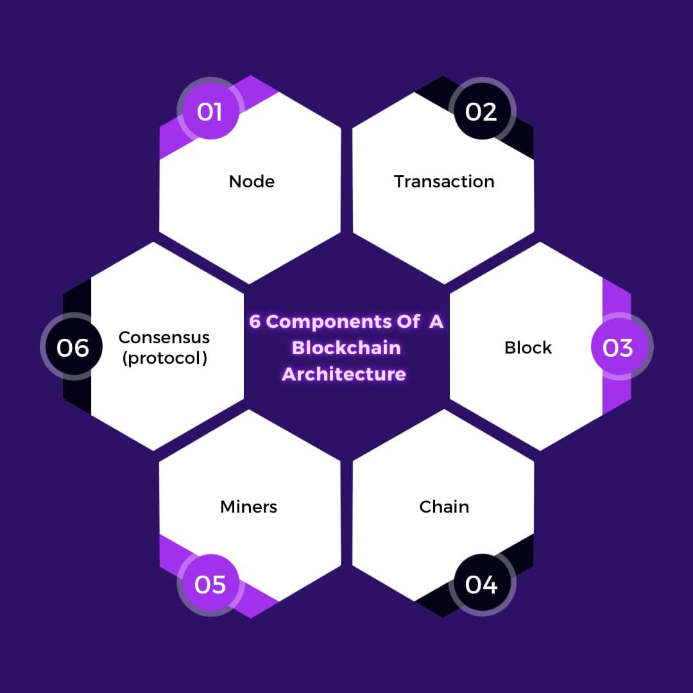
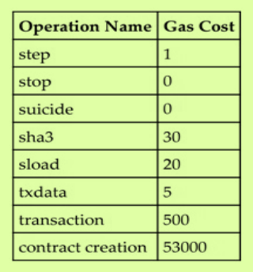
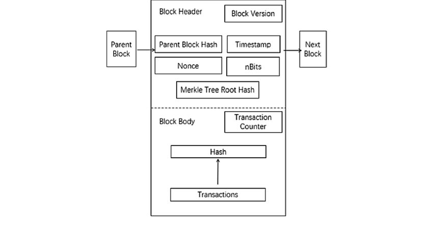
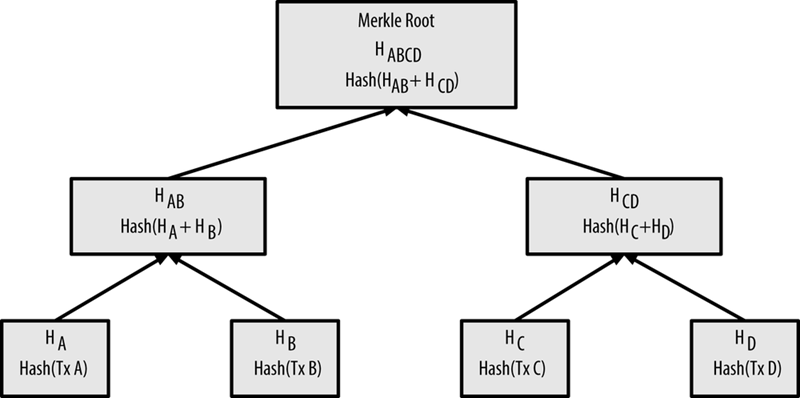
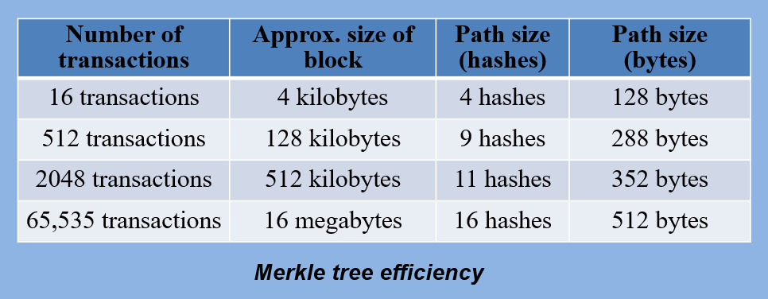

# Component of a Blockchain

Blockchain is a constantly growing **ledger** that keeps a **permanent** record of all the transactions that have taken place in a **secure**, **chronological**, and **immutable** way. 

**Node:** Nodes are network participants whose devices allow them to track the distributed ledger and serve as communication hubs for various network tasks. When a miner attempts to add a new block of transactions to the blockchain, the block broadcasts to all network nodes.

**Transactions:** A transaction involves the transfer of assets between parties, typically cash or property. In blockchain, the network of computers stores transactional data as copies, with this storage referred to as a digital ledger. It is irreversible.

**Block:** A block in a blockchain network is akin to a link in a chain. In cryptocurrency, blocks resemble records storing transactions like entries in a record book, encrypted into a hash tree. Numerous transactions occur daily worldwide, necessitating user tracking facilitated by the block structure. It is important for the users to keep track of those transactions, and they do it with the help of a block structure.

**Chain:** The concept where all blocks are interconnected forms the chain structure of the blockchain worldwide. Each block is linked with the previous block's hash, establishing a chaining structure.

**Miners:** Participants in blockchain mining validate each transaction step across all cryptocurrencies. Known as miners, they ensure transaction integrity through cryptographic verification.

**Consensus:** A fault-tolerant mechanism crucial in blockchain and computer systems. It achieves agreement on the network's state among distributed processes or multi-agent systems, essential for operations like cryptocurrency record-keeping.

# Alternative Coins / Altcoins

**ALTCOIN**

Altcoins are generally defined as all cryptocurrencies other than Bitcoin. However, some people consider altcoins to be all cryptocurrencies other than Bitcoin and Ethereum because most cryptocurrencies are forked from one of the two. Some altcoins use different consensus mechanisms to validate transactions and open new blocks, or attempt to distinguish themselves from Bitcoin and Ethereum by providing new or additional capabilities or purposes. Most altcoins are designed and released by developers who have a different vision or use for their tokens or cryptocurrency.

**Types of Altcoins**

**Payment Token:** As the name implies, payment tokens are designed to be used as currency to exchange value between parties. Bitcoin is the prime example of a payment token.

**Stablecoins:** Cryptocurrency trading and use have been marked by volatility since launch. Stablecoins aim to reduce this overall volatility by pegging their value to a basket of goods, such as fiat currencies, precious metals, or other cryptocurrencies. The basket acts as a reserve to redeem holders if the cryptocurrency fails or faces problems. Price fluctuations for stablecoins are not meant to exceed a narrow range.

**Security Tokens:** Security tokens are tokenized assets offered on stock markets. Tokenization is the transfer of value from an asset to a token, made available to investors. Any asset can be tokenized, such as real estate or stocks. For this to work, the asset must be secured and held, otherwise the tokens are worthless. Security tokens are regulated by the Securities and Exchange Commission because they are designed to act as securities.

**Utility Tokens:** Utility tokens are used to provide services within a network. For example, they might be used to purchase services, pay network fees, or redeem rewards. Filecoin, used to buy storage space and secure information on a network, is an example of a utility token.

**Meme Coins:** As their name suggests, meme coins are inspired by a joke or a silly take on other well-known cryptocurrencies. They typically gain popularity in a short period of time, often hyped online by prominent influencers or investors attempting to exploit short-term gains.

**Governance Tokens:** Governance tokens allow holders certain rights within a blockchain, such as voting for changes to protocols or having a say in decisions of a decentralized autonomous organization (DAO). Although they are generally native to a private blockchain and used for blockchain purposes, they are considered utility tokens due to their purpose.

**Pros and Cons of Altcoins**

**Pros:**
- Improve upon another cryptocurrency's weaknesses
- Higher survivability
- Thousands to choose from

**Cons:**
- Lower popularity and smaller market cap compared to Bitcoin
- Less liquidity than Bitcoin, meaning less value
- Difficult to determine use cases
- Many altcoins are scams or lose developer and community interest

# Gas Limit

Gas is a measure of computational power required to perform a transaction. The higher the gas used, the more expensive the transaction. Gas limit is the maximum amount of gas that can be used for a transaction. It is set by the user and any unused gas will be refunded to them. The gas limit is set to prevent infinite loops and other malicious activities on the Ethereum blockchain.

Gas is required to be paid for every operation performed on the Ethereum blockchain. A transaction fee is charged as some amount of Ether and is deducted from the account balance of the transaction originator. The fee ensures transactions are included by miners for mining. If the fee is too low, the transaction may not be picked up; the higher the fee, the greater the likelihood of inclusion in the block by miners.

**Transaction Cost Calculation:**
The transaction cost can be estimated using the following formula:

$$\text{Total cost} = \text{gasUsed} \times \text{gasPrice}$$

Here,
- $\text{gasUsed}$ is the total gas that is supposed to be used by the transaction during execution.
- $\text{gasPrice}$ is specified by the transaction originator as an incentive for miners to include the transaction in the next block.

**GAS LIMIT**

Each operation costs some gas; a high-level fee schedule of a few operations is shown as an example here.

**Example Calculation for SHA-3 Operation:**

- SHA-3 costs 30 gas.
- Assume the current gas price is 25 GWei. Convert it into Ether: $0.000000025$ Ether.

**Calculation:**

$$\text{Total cost} = 30 \times 0.000000025 = 0.00000075 \text{ Ether}$$

In total, $0.00000075$ Ether is the total gas charged for the SHASHA-33 operation.

# Creation of a Block

## Block Structure

The block structure is as follows:

| Size       | Field              | Description                                             |
|------------|--------------------|---------------------------------------------------------|
| 4 bytes    | Block Size         | The size of the block, in bytes, following this field   |
| 80 bytes   | Block Header       | Several fields forming the block header                  |
| 1 - 9 bytes| Transaction Counter| Indicating how many transactions follow                  |
| Variable   | Transactions       | The transactions recorded in this block                 |

The block header is 80 bytes, whereas the average transaction is at least 250 bytes and the average block contains more than 500 transactions.  
A complete block, with all transactions, is therefore 1000 times larger than the block header

## Block Header

| Size       | Field                  | Description                                           |
|------------|------------------------|-------------------------------------------------------|
| 4 bytes    | Version                | A version number to track software/protocol upgrades  |
| 32 bytes   | Previous Block Hash    | A reference to the hash of the previous (parent) block in the chain |
| 32 bytes   | Merkle Root            | A hash of the root of the Merkle tree of this block’s transactions |
| 4 bytes    | Timestamp              | The approximate creation time of this block (seconds from Unix Epoch) |
| 4 bytes    | Difficulty Target      | The proof of work algorithm difficulty target for this block |
| 4 bytes    | Nonce                  | A counter used for the proof of work algorithm        |

---

**Blockchain and Cryptocurrency**

Each block within the blockchain is identified by a hash, generated using the SHA256 cryptographic hash algorithm on the header of the block.

Each block also references a previous block, known as the parent block, through the *"previous block hash"* field in the block header.

The sequence of hashes linking each block to its parent creates a chain going back all the way to the first block ever created, known as the genesis block.

**Multiple Children and Blockchain Forks**

Although a block has just one parent, it can temporarily have multiple children. Each of the children refers to the same block as its parent and contains the same parent hash in the *"previous block hash"* field.

Multiple children arise during a blockchain *"fork,"* a temporary situation that occurs when different blocks are discovered almost simultaneously by different miners. Eventually, only one child block becomes part of the blockchain and the *"fork"* is resolved.

Even though a block may have more than one child, each block can have only one parent. This is because a block has one single *"previous block hash"* field referencing its single parent.

**Impact of Parent Block Changes**

The *"previous block hash"* field is inside the block header and affects the current block’s hash. The child’s own identity changes if the parent’s identity changes.

When the parent is modified in any way, the parent’s hash changes. This necessitates a change in the *"previous block hash"* pointer of the child, which in turn causes the child’s hash to change. This cascading effect continues down the chain, requiring changes in subsequent blocks.

This cascade effect ensures that once a block has many generations following it, it cannot be changed without recalculating all subsequent blocks. This immutable chain of blocks is a key feature of Bitcoin’s security.

# Merkle Tree

A _Merkle tree_, also known as a binary _hash tree_, is a data structure used for efficiently summarizing and verifying the integrity of large sets of data. Merkle trees are binary trees containing cryptographic hashes.

Merkle trees are used in bitcoin to summarize all the transactions in a block, producing an overall digital fingerprint of the entire set of transactions, providing a very efficient process to verify whether a transaction is included in a block.

A Merkle tree is constructed by recursively hashing pairs of nodes until there is only one hash, called the *root*, or *merkle root*. The cryptographic hash algorithm used in bitcoin's merkle trees is _SHA256_ applied twice, also known as double-_SHA256_.

**Benefits:**
- **Efficiency:** Merkle trees offer a highly efficient method for verifying data integrity with minimal computational overhead. They enable rapid verification of transactions and data blocks within a blockchain, enhancing the overall performance and reliability of decentralized networks like Bitcoin.

**Conclusion:**
Merkle trees are a foundational component of blockchain technology, providing a secure and efficient means to verify large datasets. Their hierarchical structure and cryptographic properties ensure data integrity and authenticity, making them indispensable for maintaining trust and reliability in decentralized systems.

# Transactions

Tranactions refer to the transfer of assets between parties, typically cash or property. They are stored in a blockchain as copies, with this storage referred to as a digital ledger. They are irreversible. 

Transactions are not encrypted and are publicly visible in the blockchain. Blocks are made up of transactions, and these can be viewed using any online blockchain explorer. 

### The Transaction Life Cycle

The following steps describe the transaction lifecycle of a Bitcoin transaction:

1. **User/Sender Sends a Transaction:**
   - A user or sender sends a transaction using wallet software or another interface.

2. **Transaction Signing:**
   - The wallet software signs the transaction using the sender's private key.

3. **Transaction Broadcast:**
   - The signed transaction is broadcasted to the Bitcoin network using a flooding algorithm.

4. **Verification and Inclusion in a Block:**
   - Mining nodes (miners) listening for transactions verify and include the transaction in the next block to be mined. Before being placed in a block, transactions are stored in a special memory buffer called the transaction pool.

5. **Mining Process:**
   - Mining begins, where the blockchain is secured and new coins are generated as a reward for miners who spend appropriate computational resources.

6. **Solution of Proof of Work (PoW):**
   - Once a miner solves the PoW problem, they broadcast the newly mined block to the network.

7. **Block Verification and Propagation:**
   - Nodes verify the block and propagate it further through the network. Confirmations start to generate.

8. **Transaction Finalization:**
   - Finally, confirmations begin to appear in the receiver's wallet. After approximately three confirmations (recommended), the transaction is considered finalized and confirmed. Waiting for multiple confirmations reduces the probability of double-spending.
