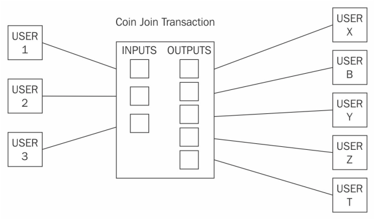
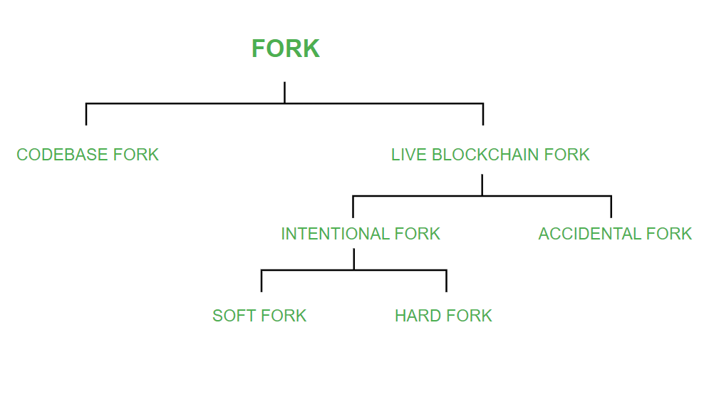
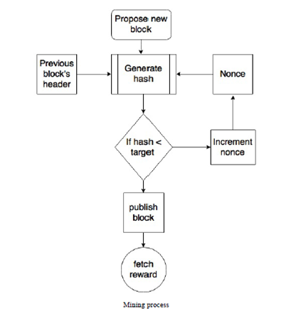
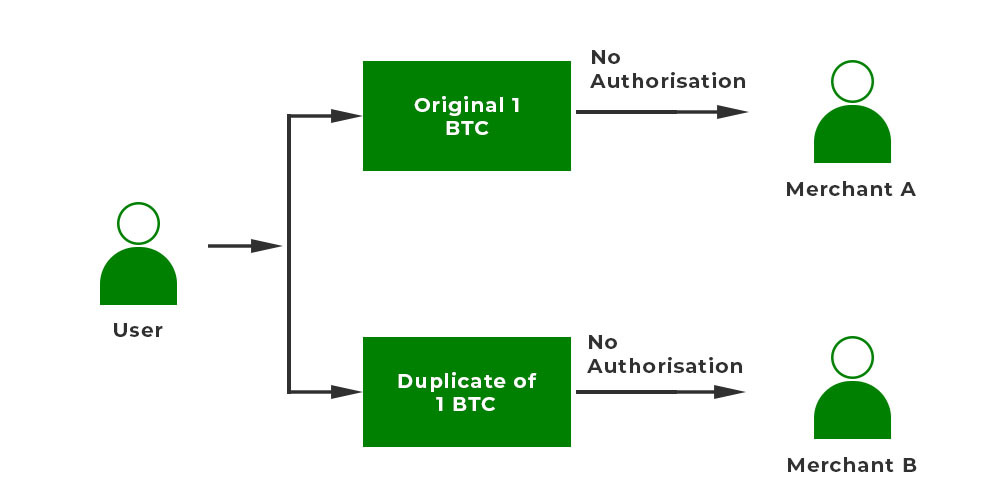
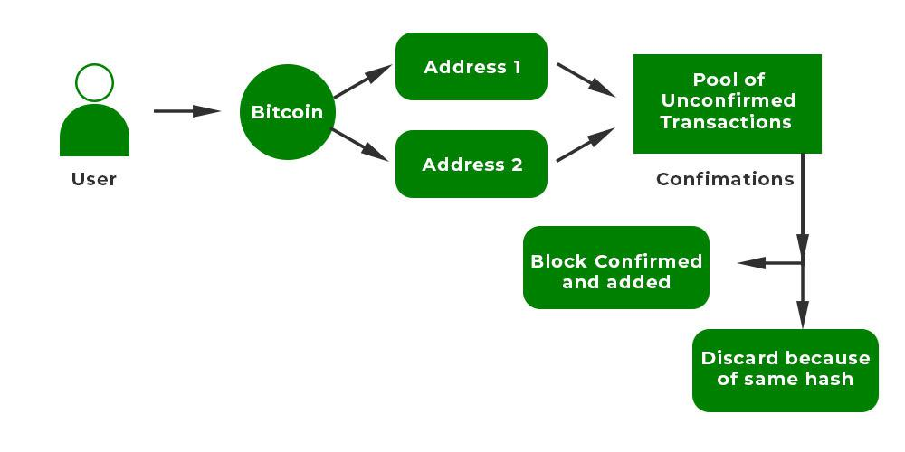

# Mining Systems in Blockchain

> ***NOTE: The below text shows the evolution of mining systems in blockchain. If you want the types (PoW, PoS), refer to other notes***

Mining is a fundamental process in blockchain networks, particularly in Bitcoin, where it involves the validation of transactions and the addition of these transactions to the blockchain. Miners compete to solve complex mathematical problems, and the first to solve it gets to add a new block to the blockchain and is rewarded with newly created bitcoins and transaction fees.

### 1. CPU Mining

**Description:**  
CPU (Central Processing Unit) mining was the earliest method used to mine Bitcoin. In the initial days of Bitcoin, users could mine using their regular laptop or desktop computers. The mining process involves solving complex mathematical problems using the CPU's processing power.

**Evolution and Challenges:**  
- **Profitability Decline:** CPU mining became unprofitable within just over a year since the introduction of Bitcoin due to increasing difficulty levels and the emergence of more efficient mining methods.
- **Technology Limitation:** CPUs are not optimized for the parallel processing required for efficient mining, making them slow and inefficient compared to newer methods.

### 2. GPU Mining

**Description:**  
GPU (Graphics Processing Unit) mining became popular as miners shifted from CPUs. GPUs, which are typically used for rendering graphics in PCs, proved to be more efficient for mining due to their ability to perform parallel calculations.

**Evolution and Challenges:**  
- **Performance Boost:** GPUs offered faster processing speeds compared to CPUs, especially when programmed using frameworks like OpenCL.
- **Limitations:** Challenges included overheating issues, the need for specialized hardware setups (e.g., multiple GPUs, specialized motherboards), and increased costs due to high demand from both miners and gamers.

### 3. FPGA Mining

**Description:**  
FPGA (Field Programmable Gate Array) mining followed GPU mining. FPGAs are programmable integrated circuits that can be customized to perform specific tasks like mining operations.

**Evolution and Challenges:**  
- **Performance Improvement:** FPGAs provided significant performance gains over GPUs for mining due to their programmability and efficiency.
- **Accessibility Issues:** Programming FPGAs required expertise in Hardware Description Languages (HDLs) like Verilog and VHDL, limiting their widespread adoption.
- **Short Lifespan:** FPGA mining was quickly overshadowed by the introduction of ASICs (Application Specific Integrated Circuits).

### 4. ASIC Mining

**Description:**  
ASICs are specialized hardware designed specifically for mining cryptocurrencies. They are highly efficient in performing the specific hashing algorithms (like SHA-256 for Bitcoin) used in mining.

**Evolution and Challenges:**  
- **High Hash Rates:** ASICs offer extremely high hash rates, making them much more efficient than CPUs, GPUs, and FPGAs.
- **Centralization Concerns:** ASICs have led to mining becoming centralized in the hands of large mining operations due to their cost and energy requirements.
- **Profitability Shift:** Mining with ASICs has made it difficult for individual miners to compete without significant investment in hardware and electricity costs.

### Mining Pools

**Description:**  
Mining pools are collaborative groups where multiple miners combine their computational resources to increase their chances of successfully mining a block. If a block is mined, the reward is distributed among all participants based on their contributed computational power.

**Evolution and Challenges:**  
- **Increased Efficiency:** Mining pools offer a more consistent income stream compared to solo mining.
- **Centralization Risk:** Large mining pools can potentially control a significant portion of the network hash rate, posing risks like the potential for a 51% attack.
- **Profit Distribution Models:** Pools use various models (e.g., Pay Per Share, Proportional) to distribute rewards among participants.

# Bitcoin Script

Bitcoin Script is a fundamental component of the Bitcoin protocol, serving as a scripting language that defines the conditions under which transactions are executed. Here's a detailed exploration of Bitcoin Script, along with an example illustrating its usage in a typical transaction scenario.

### Bitcoin Script Overview

Bitcoin Script is:
- **Stack-Based**: It operates using a stack data structure where operations are performed on a last-in, first-out (LIFO) basis. This makes it efficient and straightforward for handling transactions.
  
- **Forth-Like**: Similar to Forth, a programming language known for its simplicity and stack manipulation capabilities. Bitcoin Script utilizes postfix notation (Reverse Polish Notation, RPN) where operations follow operands, making it concise and predictable.
  
- **Turing Incomplete**: Designed intentionally without certain features like loops to prevent potentially infinite execution scenarios. This enhances security by avoiding the halting problem, ensuring scripts can't stall the Bitcoin network.

### Example: Pay To PubKey Hash (P2PKH) Transaction

Let’s illustrate Bitcoin Script in action through a basic P2PKH transaction:

1. **Scenario Setup**:
   - Alice wants to send 1 Bitcoin (BTC) to Bob.
   - Bob has provided Alice with his Bitcoin address, which is derived from his public key and encoded using Base58Check.

2. **Transaction Process**:
   - **Locking Script (scriptPubKey)**:
     - Alice creates a transaction specifying Bob's Bitcoin address as the recipient (`Bob'sPubKeyHash`). This address is converted into a locking script (`scriptPubKey`) which locks the funds to Bob's address.
     - The locking script typically looks like: `OP_DUP OP_HASH160 <Bob'sPubKeyHash> OP_EQUALVERIFY OP_CHECKSIG`.
     - This script ensures that the transaction output can only be spent by providing a valid signature matching the public key hash (`Bob'sPubKeyHash`).

3. **Transaction Execution**:
   - Alice broadcasts the transaction to the Bitcoin network.
   - Miners validate the transaction, ensuring Alice has sufficient funds and Bob’s locking conditions (`scriptPubKey`) are met.

4. **Unlocking Script (scriptSig)**:
   - When Bob wants to spend the received 1 BTC, he must provide an unlocking script (`scriptSig`) in the transaction input.
   - The unlocking script includes a digital signature created using Bob’s private key and the public key corresponding to `Bob'sPubKeyHash`.
   - The scriptSig typically looks like: `<Bob'sSignature> <Bob'sPublicKey>`.

5. **Transaction Verification**:
   - Miners verify the transaction input by executing both the unlocking script (`scriptSig`) and the locking script (`scriptPubKey`).
   - If the unlocking script provides a valid signature and meets the conditions set by the locking script, the transaction is considered valid.

6. **Transaction Confirmation**:
   - Once confirmed by the network, the 1 BTC is transferred from Alice's UTXO to Bob's, and Bob can now spend these funds in future transactions.

# Bitcoin Wallets

> ***NOTE: Still not sure about this answer***  
> *The follwing link showed prommising results: https://www.babypips.com/crypto/learn/what-are-different-types-of-bitcoin-wallets*

Bitcoin wallets are a secure and convenient way to store and manage Bitcoin transactions. They offer convenience and security, but they also require trust in the service provider's security measures.

Bitcoin wallets can be classified into several types based on how they store and manage private keys, their security features, and accessibility. Here's a detailed classification of Bitcoin wallets:

### 1. Non-deterministic Wallets
- **Description**: Also known as "just a bunch of keys" wallets.
- **Characteristics**:
  - Private keys are randomly generated by the wallet software.
  - Each new key is generated separately as needed.
  - Requires regular backups and secure storage of each key.
- **Example**: Bitcoin Core client wallets before deterministic features were introduced.

### 2. Deterministic Wallets
- **Description**: Wallets where keys are derived from a seed value.
- **Characteristics**:
  - Keys are generated deterministically using a seed (typically a mnemonic phrase).
  - Offers easier backup and recovery of all keys derived from the seed.
  - Improves key management and reduces the risk of key loss.
- **Example**: Wallets following BIP 39 standard, like Electrum and Jaxx.

### 3. Hierarchical Deterministic (HD) Wallets
- **Description**: A type of deterministic wallet that organizes keys in a tree structure.
- **Characteristics**:
  - Uses a single seed to generate a master key from which all subsequent keys are derived.
  - Allows for easy backup and restoration of an entire wallet using the master key.
  - Enhances portability and organization of keys.
- **Example**: Trezor, Ledger wallets, and software wallets like Electrum that support BIP 32 and BIP 44.

### 4. Brain Wallets
- **Description**: Wallets where the private key is derived from a passphrase memorized by the user.
- **Characteristics**:
  - Private key is generated deterministically from the passphrase.
  - Vulnerable to brute-force attacks if the passphrase is weak.
  - Riskier compared to other types of wallets due to potential passphrase vulnerabilities.
- **Example**: Any wallet that supports generating keys from a passphrase entered by the user.

### 5. Paper Wallets
- **Description**: Physical printouts or offline documents containing keys.
- **Characteristics**:
  - Private keys and addresses are printed or written on paper.
  - Requires physical security and careful handling to prevent loss or theft.
  - Often used for long-term storage rather than frequent transactions.
- **Example**: Generated through services like BitcoinPaperWallet.com or BitAddress.org.

### 6. Hardware Wallets
- **Description**: Secure physical devices designed specifically for key storage.
- **Characteristics**:
  - Tamper-resistant hardware provides enhanced security against physical and remote attacks.
  - Private keys never leave the device, ensuring they are not exposed to online threats.
  - Typically used for significant amounts of cryptocurrency due to their high security.
- **Example**: Trezor, Ledger Nano S/X, and other hardware wallets with secure elements.

### 7. Online Wallets
- **Description**: Wallets hosted and accessed via the internet.
- **Characteristics**:
  - Convenient for everyday transactions and accessible from any device with an internet connection.
  - Relies on the security practices of the online service provider.
  - Generally easier to use but potentially less secure compared to hardware wallets.
- **Example**: GreenAddress, Blockchain.info, and other web-based wallet services.

### 8. Mobile Wallets
- **Description**: Wallet applications installed on mobile devices (smartphones, tablets).
- **Characteristics**:
  - Offers mobility and convenience for making payments on the go.
  - Typically includes QR code scanning for easy payment processing.
  - May vary in security based on the app and device security practices.
- **Example**: Blockchain Wallet, Breadwallet (now BRD), Electrum, Jaxx, and other mobile apps.

### Considerations
Choosing the right Bitcoin wallet depends on factors such as security preferences, convenience, and usage scenarios. Hardware wallets are generally recommended for long-term storage due to their robust security features, while mobile and online wallets offer convenience but require trust in the service provider's security measures. Paper wallets provide offline security but require careful handling. Understanding these distinctions helps users make informed decisions based on their specific needs and priorities.

# Anonymity

Anonymity, particularly in the context of financial transactions like Bitcoin, refers to the ability of users to conduct transactions without revealing their true identity or personal information. It involves masking the link between the real-world identity of the sender or recipient and their transactions on the blockchain, the public ledger that records all Bitcoin transactions.

### Types of Anonymity

1. **Pseudonymity**: Bitcoin transactions are pseudonymous, meaning users interact using pseudonyms or Bitcoin addresses rather than their real names. Each transaction is linked to a Bitcoin address, which is a hash of the public key used to send and receive Bitcoins. Pseudonymity allows users to maintain a level of privacy by not directly associating their real-world identity with their Bitcoin transactions.

2. **Unlinkability**: True anonymity requires unlinkability, meaning that it should be difficult to connect multiple transactions or addresses to the same user over time. This prevents someone from tracing a series of transactions back to a single entity or tracking spending habits across different transactions.

### Challenges to Anonymity in Bitcoin

While Bitcoin offers pseudonymity, several factors challenge its anonymity:

- **Blockchain Transparency**: Bitcoin's blockchain is publicly accessible and transparent. Every transaction, once confirmed, is recorded permanently and can be viewed by anyone. This transparency allows for transaction analysis, which can potentially reveal patterns and links between addresses.

- **Transaction Graph Analysis**: Techniques like transaction graph analysis can exploit the transparency of the blockchain. By analyzing patterns in transaction flows and linking multiple addresses to a single user based on spending habits or identifiable patterns (like change addresses), researchers or adversaries can deanonymize users.

- **Address Reuse**: Reusing Bitcoin addresses can compromise anonymity. If multiple transactions are associated with a single address, it becomes easier to link those transactions together, reducing the unlinkability of the user's activities.

- **IP Address Deanonymization**: When users broadcast transactions to the Bitcoin network, their IP addresses can potentially be exposed. Although techniques like using TOR can mitigate this risk, sophisticated adversaries may still be able to deanonymize transactions by correlating IP addresses with transaction timing and patterns.

### Enhancing Anonymity in Bitcoin

Several methods and technologies aim to enhance anonymity in Bitcoin transactions:

- **Mixing Services**: Mixing or coin tumbling services aim to break the link between the sender and recipient addresses by mixing coins from multiple users. This process makes it harder to trace the origin of specific coins, thus enhancing anonymity.

- **Privacy Coins**: Cryptocurrencies like Monero and Zcash incorporate specific features (such as ring signatures and zero-knowledge proofs) to achieve stronger anonymity and privacy guarantees compared to Bitcoin.

- **Improving Practices**: Users can adopt best practices like using new addresses for each transaction, avoiding address reuse, and using technologies like TOR or VPNs to obfuscate their IP addresses when interacting with the Bitcoin network.

# Transaction Verification

Bitcoin transaction verification is a critical process within the Bitcoin network that ensures the validity and integrity of transactions before they are permanently recorded on the blockchain. Here’s a detailed explanation of how Bitcoin transaction verification works:

### Overview of Bitcoin Transactions

Bitcoin transactions involve the transfer of value (Bitcoins) from one address to another. Each transaction is broadcasted to the entire network of nodes (computers running the Bitcoin software) where it awaits validation and inclusion in a block.

### Steps in Bitcoin Transaction Verification

1. **Transaction Propagation**: When a user initiates a Bitcoin transaction, it is broadcasted to all nodes in the network. Nodes collect these transactions in a memory pool (mempool) where they wait to be selected by miners to be included in the next block.

2. **Transaction Validation by Nodes**:
   - **Syntax and Data Structure Check**: Nodes first validate the transaction’s syntax and data structure to ensure it conforms to Bitcoin’s protocol rules. This includes verifying that the transaction format, inputs, outputs, and other details are correctly formatted.
   
   - **Script Validation**: Each transaction includes a script that specifies conditions for spending the Bitcoins (e.g., providing a valid digital signature). Nodes verify that the script executes correctly and that the spender has the necessary private keys to authorize the transaction.

   - **Double Spending Prevention**: Nodes check that the transaction inputs (Bitcoins being spent) have not been spent before in any previous transactions. This prevents double spending, where the same Bitcoins are used in multiple transactions simultaneously.

   - **Transaction Outputs**: Nodes verify that the sum of inputs equals the sum of outputs to ensure there’s no creation or destruction of Bitcoins beyond the specified rules.

3. **Transaction Propagation and Inclusion**: Once a transaction is validated by a node, it propagates it to other nodes in the network. Miners select transactions from the mempool to include in a new block they are mining.

### Role of Miners in Transaction Verification

While nodes perform initial transaction validation, miners play a crucial role in:
- **Block Creation**: Miners collect validated transactions and attempt to create a new block by solving a cryptographic puzzle (Proof of Work).
- **Inclusion in Blockchain**: Once a miner solves the puzzle, they broadcast the new block to the network. Other nodes and miners verify the block and its transactions before adding it to their own copy of the blockchain.

# Forks

Forks in blockchain technology result from divergences in protocol and consensus rules, leading to multiple valid versions of the blockchain. They fall into two main categories: Codebase Forks and Live Blockchain Forks.

### 1. Codebase Forks

**Definition:** Developers modify the original blockchain code (e.g., Bitcoin) to create a new blockchain with different rules. 

**Example:** Litecoin (LTC) was created as a codebase fork of Bitcoin, adjusting parameters like hashing algorithm and block time.

**Characteristics:**
- **Independent Blockchain:** Starts with a unique genesis block.
- **Development Independence:** Allows for experimenting with new features or consensus mechanisms.

### 2. Live Blockchain Forks

These occur within an existing blockchain network due to disagreements or network issues.

#### a. Intentional Forks

**Definition:** Deliberate changes to add features or alter consensus.

**i. Soft Fork**
- **Backwards-Compatible:** New rules are compatible with old rules.
- **Example:** Bitcoin’s SegWit introduced new transaction formats without invalidating old ones.

**ii. Hard Fork**
- **Non-Compatible:** New rules require node upgrades.
- **Example:** Ethereum split into ETH and ETC after the DAO hack to reverse transactions.

#### b. Accidental Forks (Temporary Forks)

**Definition:** Temporary divergences due to network issues like simultaneous block mining.

**Characteristics:**
- **Temporary:** Resolves as the network converges on a single chain.
- **Example:** Common in Bitcoin where simultaneous mining leads to brief splits.

### Reasons for Forks

- **Development Updates:** Introduce new features, enhance security, or fix bugs.
- **Disagreements:** Over protocol changes, governance, or economic incentives.
- **Emergency Fixes:** Address security breaches or vulnerabilities.

# Miner Tasks in Bitcoin

In the Bitcoin network, miners play a crucial role in maintaining the blockchain and ensuring its security through a process called mining. Here’s a detailed explanation of the tasks performed by miners:

### Tasks of Miners in the Bitcoin Network

1. **Synchronizing with the Network:**
   - When a new node joins the Bitcoin network, it synchronizes by downloading the blockchain. This involves requesting historical blocks from other nodes to build a complete and up-to-date ledger.

2. **Transaction Validation:**
   - Miners validate transactions broadcasted on the network. This includes verifying signatures and ensuring that inputs and outputs match the ledger’s history.

3. **Block Validation:**
   - Upon receiving a new block, miners and full nodes validate it against Bitcoin’s consensus rules. This involves confirming that all transactions within the block are legitimate and comply with protocol standards.

4. **Creating a New Block:**
   - Miners select valid transactions from the memory pool (mempool) and group them into a new block. The miner then adds a block header that includes a timestamp, a reference to the previous block’s hash, and a nonce (a 32-bit field).

5. **Performing Proof of Work (PoW):**
   - The core task of mining is solving a cryptographic puzzle known as Proof of Work. Miners repeatedly modify the nonce in the block header until the resulting hash meets a predefined difficulty target. This process requires substantial computational effort and energy.

6. **Broadcasting the Block:**
   - Once a miner finds a nonce that satisfies the PoW requirement (i.e., the hash of the block header is less than the target), they broadcast the new block to the network.

7. **Reward Collection:**
   - Miners who successfully mine a new block are rewarded with a fixed amount of newly minted bitcoins (currently 6.25 BTC per block as of the latest halving) in addition to transaction fees included in the block.

### Proof of Work (PoW) in Detail

- **Purpose:** PoW serves as a consensus mechanism to secure the blockchain against fraud and ensure that only valid transactions are added to the ledger.
- **Mechanism:** Miners compete to find a nonce that, when combined with the block header and transactions, produces a hash that meets the difficulty target set by the network.
- **Difficulty Adjustment:** Bitcoin’s protocol adjusts the difficulty target every 2016 blocks (approximately every two weeks) to maintain an average block generation time of 10 minutes, regardless of changes in network hash rate.

### Mining Challenges and Innovations

- **Increasing Difficulty:** Over time, as more miners join the network, the difficulty of finding a valid block hash increases, requiring more computational power.
- **Extra Nonce Solution:** To expand the range of nonce values available for mining, miners use the extra nonce field in the coinbase transaction, which allows for a larger set of potential solutions.

# Double Spending Problem

The double spending problem is a critical issue in digital currency systems like blockchain, where it refers to the risk of spending the same digital tokens more than once. Here’s an explanation of the problem and how it is addressed in blockchain systems, particularly using Bitcoin as an example:

### Understanding Double Spending

**Definition:** Double spending occurs when a user spends the same digital currency more than once, effectively creating multiple transactions that attempt to use the same funds.

**Nature of Digital Currency:** Digital currencies like Bitcoin are essentially digital files that can be duplicated. Unlike physical money, which cannot be in two places at once, digital currencies can be copied and spent in multiple transactions unless preventive measures are in place.

**How Double Spending Happens:**
1. **Online Transactions:** Since digital currencies exist as files, a malicious user can duplicate these files and attempt to spend them simultaneously.
2. **Network Alterations:** Changes in the network or disruptions can sometimes lead to transactions being duplicated unintentionally.
3. **Unconfirmed Transactions:** If a transaction is not confirmed by the network (such as through blockchain consensus mechanisms), there is a window of opportunity for double spending.
4. **Reversal of Transactions:** In some cases, hackers attempt to reverse transactions after they have received the service or goods, effectively spending the same funds twice.

### Types of Double Spending Attacks

1. **Finney Attack:** Named after Hal Finney, this attack involves a hacker pre-mining a transaction and using it to purchase goods or services. The hacker then releases a blockchain with a conflicting transaction that transfers the same funds elsewhere, exploiting the delay in block propagation.
   
2. **Race Attack:** In this scenario, an attacker sends two conflicting transactions to different parts of the network simultaneously. The aim is for one of the transactions to be accepted while the other is rejected, ideally allowing the attacker to double spend.
   
3. **51% Attack:** This occurs when a malicious entity gains majority control (51% or more) of the network’s mining hash rate. With such control, the attacker can theoretically reverse transactions and execute double spending.

### How Bitcoin Handles Double Spending

Bitcoin employs several security measures to mitigate the risk of double spending:

1. **Transaction Validation:** Every transaction in the Bitcoin network is validated by nodes (computers participating in the network). Nodes verify that the sender has the necessary funds and that the transaction follows the rules of the network.
   
2. **Consensus Mechanism:** Bitcoin uses a consensus mechanism called Proof of Work (PoW), where miners compete to solve complex mathematical puzzles to validate transactions and add them to the blockchain. This process ensures that only one valid transaction is accepted for each spending of funds.
   
3. **Confirmation Process:** After a transaction is included in a block and added to the blockchain, it needs to be confirmed by a certain number of subsequent blocks (typically six confirmations in Bitcoin) to be considered irreversible. This minimizes the risk of a transaction being reversed or double spent.
   
4. **Decentralization:** By operating on a decentralized network where transactions are verified by multiple nodes, Bitcoin ensures that no single entity can manipulate the transaction history or perform double spending attacks without consensus from the majority of the network.

### Solutions to Prevent Double Spending

1. **Centralized Approach:** Some systems use a centralized authority to verify transactions and maintain a single ledger. This approach is vulnerable to single points of failure and requires trust in the central authority.

2. **Decentralized Approach (Blockchain):** Bitcoin and similar blockchain technologies use a decentralized approach where transactions are verified and recorded by multiple nodes. Consensus mechanisms like PoW ensure that only valid transactions are accepted and prevent double spending through cryptographic proof and network agreement.

#  Distributed Consensus Mechanism 

Distributed consensus mechanisms are fundamental to blockchain technology, ensuring that all nodes in a network agree on the current state of the blockchain without relying on a central authority. This agreement is crucial for maintaining the integrity, security, and reliability of decentralized systems like Bitcoin and Ethereum. Here’s an in-depth look into distributed consensus mechanisms:

### What is Distributed Consensus?

Distributed consensus refers to the process by which nodes in a decentralized network achieve agreement on the validity and order of transactions. In a blockchain context, consensus mechanisms ensure that all nodes maintain a consistent view of the blockchain ledger, even though they may initially have different information due to network latency, malicious actors, or other factors.

### Key Requirements for Distributed Consensus:

1. **Decentralization:** The absence of a central authority means decisions must be made collectively by all participating nodes.
   
2. **Agreement:** All honest nodes eventually agree on the same sequence of transactions and their order.
   
3. **Fault Tolerance:** The system can continue to operate correctly even if some nodes are malfunctioning, unresponsive, or acting maliciously.
   
4. **Security:** Prevents unauthorized transactions and ensures that the ledger cannot be tampered with by malicious entities.

### Common Distributed Consensus Mechanisms:

1. **Proof of Work (PoW):**
   - **Definition:** PoW is the original consensus mechanism used by Bitcoin. Miners compete to solve complex mathematical puzzles, and the first to solve it broadcasts the solution to the network. Other nodes verify the solution, and if correct, the block is added to the blockchain.
   - **Security:** Provides strong security against attacks due to the computational cost required to solve puzzles.
   - **Drawbacks:** High energy consumption, scalability challenges, and potential centralization in mining pools.

2. **Proof of Stake (PoS):**
   - **Definition:** PoS selects validators based on the amount of cryptocurrency they hold and are willing to "stake" as collateral. Validators are chosen to create new blocks based on their stake, and they are rewarded accordingly.
   - **Advantages:** Energy-efficient compared to PoW, encourages coin ownership and participation in network security.
   - **Challenges:** Potential issues with initial distribution of wealth, "nothing at stake" problem, and security concerns regarding large stakeholders.

3. **Delegated Proof of Stake (DPoS):**
   - **Definition:** Similar to PoS, but instead of all token holders participating directly in the consensus process, they vote for delegates who validate transactions and create blocks.
   - **Benefits:** Scalability improvements, faster transaction speeds, and lower energy consumption compared to PoW.
   - **Concerns:** Centralization risks as fewer delegates could control the network, potential voter apathy in delegate selection.

4. **Practical Byzantine Fault Tolerance (PBFT):**
   - **Definition:** PBFT is a classic consensus algorithm designed to function in environments where Byzantine failures (malicious or arbitrary behavior) can occur. Nodes exchange messages proposing and agreeing on the order of transactions.
   - **Advantages:** Fast transaction finality, low energy consumption, suitable for permissioned blockchains or consortium networks.
   - **Limitations:** Requires a predetermined set of nodes, less suitable for fully decentralized public blockchains due to scalability and trust assumptions.

5. **Raft Consensus:**
   - **Definition:** Raft is another consensus algorithm designed for fault-tolerant replication. It elects a leader among nodes that manages log replication, ensuring consistency across the network.
   - **Advantages:** Simpler to understand and implement than PBFT, suitable for systems requiring availability and partition tolerance over consistency.
   - **Drawbacks:** Less fault-tolerant compared to PBFT in environments with Byzantine failures.

