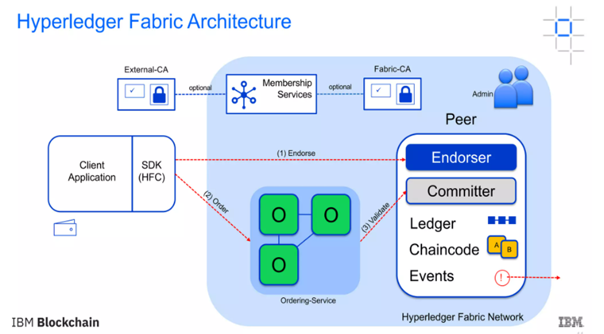

# Hyperledger 

Hyperledger is an open-source project under the Linux Foundation dedicated to developing blockchain-related use cases across various industrial sectors. It supports the creation of blockchain-based distributed ledgers and provides infrastructure for developing enterprise-ready, permissioned blockchain platforms.

**Key Features:**
- **Supports Blockchain Development:** Focuses on creating blockchain-based distributed ledgers.
- **Enterprise-Ready Platforms:** Includes various permissioned blockchain platforms.
- **Global Collaboration:** Aims to develop high-performance and reliable blockchain and distributed ledger technology frameworks.

**Benefits:**
- **Enhanced Efficiency:** Improves the efficiency, performance, and transactions of business processes.
- **Infrastructure and Standards:** Provides necessary infrastructure and standards for industrial blockchain-based systems and applications.
- **Simplification of Agreements:** Reduces complexity in contractual agreements by addressing legal issues.
- **Data Security:** Offers physical separation of sensitive data.
- **Trust and Scalability:** Enhances trust, optimizes network performance, and scalability by reducing verification needs.

# Hyper Ledger Fabric Architecture

Hyperledger Fabric is a modular blockchain framework that provides a robust and flexible architecture for enterprise use. It consists of several key components that work together to provide a secure and efficient blockchain solution.

### Key Components of Hyperledger Fabric

1.  **Membership Service Provider (MSP)**
    
    *   The MSP is responsible for managing identities in the network. It issues and validates certificates to ensure only authorized participants can join the network.
2.  **Ledger**
    
    *   The ledger in Hyperledger Fabric consists of two parts: the world state and the blockchain.
        *   **World State**: A database that holds the current state of ledger data as key-value pairs.
        *   **Blockchain**: A transaction log that records all the changes to the world state, ensuring immutability.
3.  **Peers**
    
    *   Peers are the nodes in the network that maintain the ledger and execute smart contracts. They can have different roles:
        *   **Endorser**: Validates and signs transactions before they are committed to the ledger.
        *   **Committer**: Adds validated transactions to the ledger.
4.  **Ordering Service**
    
    *   This service ensures the proper sequencing of transactions and creates blocks to be added to the blockchain. It decouples the transaction ordering from the actual transaction processing, enhancing scalability and performance.
5.  **Channels**
    
    *   Channels provide a way to partition the network into sub-networks, allowing transactions to be visible only to parties involved in those transactions. Each channel has its own ledger.
6.  **Smart Contracts (Chaincode)**
    
    *   Smart contracts, written in chaincode, define the business logic that is executed by the peers. They are responsible for generating new facts to be added to the ledger.

# Transaction Flow in Hyperledger Fabric

#### Step-by-Step Explanation

1.  **Client Initiates a Transaction:**
    
    *   **Client A** sends a request to **Client B** to purchase goods (e.g., radishes).
    *   The request targets **Peer A** and **Peer B**, who represent **Client A** and **Client B** respectively.
    *   The endorsement policy requires both peers to endorse the transaction, so the request goes to both **Peer A** and **Peer B**.
    *   A transaction proposal, which is a request to invoke a chaincode function to read or update the ledger, is constructed using the Software Development Kit (SDK).
    *   The SDK uses the user’s cryptographic credentials to produce a unique signature for the transaction proposal.
    *   The SDK submits the transaction proposal to the target peer, which forwards it to other peers for execution.
  
2.  **Endorsing Peers Verify the Signature and Execute the Transaction:**
    
    *   The endorsing peers verify:
        *   The transaction proposal is well-formed.
        *   The transaction proposal has not been submitted before to protect against replay attacks.
        *   The signature is valid.
        *   The submitter (Client A) satisfies the channel’s writers’ policy and is authorized to perform the proposed operation on the channel.
  
3.  **Proposal Responses are Inspected:**
    
    *   The target peer verifies the proposal responses.
    *   Even if checking is not performed, the Hyperledger Fabric architecture ensures that the endorsement policy is checked and enforced when each peer validates transactions before committing them.
  
4.  **Target Peer Assembles Endorsements into a Transaction:**
    
    *   The target peer broadcasts transaction messages containing transaction proposals and responses to the ordering service. This includes:
        *   Channel ID
        *   Read/Write sets
        *   A signature for each endorsing peer
    *   The ordering service receives the transactions, orders them, and creates blocks of transactions per channel. It does not inspect the entire content of the transaction.

5.  **Transaction is Validated and Committed:**
    
    *   Blocks of transactions are delivered to all peers on the channel.
    *   Peers validate the transactions within the block to ensure the endorsement policy is fulfilled.
    *   Validated transactions are then committed to the ledger. 

# Hyperledger Fabric Details

### Introduction

Hyperledger Fabric is a permissioned blockchain infrastructure, initially developed by IBM, that offers a modular architecture. It is designed for enterprise use cases, enabling the development of blockchain-based distributed ledger applications.

### Key Components

1.  **Membership Service Provider (MSP):**
    
    *   MSP is the mechanism that defines the rules for validating identities on the network.
    *   It involves the issuance of identities by Certificate Authorities (CAs) and ensures that these identities are recognized by the network.
2.  **Ledger:**
    
    *   The ledger in Hyperledger Fabric consists of two components:
        *   **World State:** A database that holds the current values of a set of ledger states, expressed as key-value pairs.
        *   **Blockchain:** An immutable transaction log that records all the changes that have resulted in the current world state.
3.  **Channel:**
    
    *   Channels provide a way for multiple stakeholders to share a common view of a ledger.
    *   Each channel has a separate ledger, allowing for private and confidential transactions among participants.
4.  **Peer Nodes:**
    
    *   Peers maintain the ledger and execute smart contracts (chaincode).
    *   Peers can take on two roles:
        *   **Endorser:** Simulates and signs transactions.
        *   **Committer:** Validates and commits transactions to the ledger.
5.  **Ordering Service:**
    
    *   Responsible for ordering transactions and creating blocks.
    *   Ensures the consistency of the blockchain by delivering the same order of transactions to all peers.
6.  **Smart Contracts and Chaincode:**
    
    *   Smart contracts define the business logic that is executed during transactions.
    *   Chaincode is the term used for smart contracts in Hyperledger Fabric and is deployed on the network.

### Hyperledger Technology Layers

1.  **Consensus Layer:**
    
    *   Manages the agreement on the order and correctness of transactions within a block.
2.  **Smart Contract Layer:**
    
    *   Handles the processing of transaction requests and the authorization of valid transactions.
3.  **Communication Layer:**
    
    *   Manages peer-to-peer message transport.
4.  **Identity Management Services:**
    
    *   Establish trust on the blockchain by managing identities.
5.  **API Layer:**
    
    *   Allows external applications and clients to interact with the blockchain.

### Benefits of Hyperledger Fabric

1.  **Permissioned Network:**
    
    *   Provides a higher level of security and trust by restricting access to the network.
2.  **Confidential Transactions:**
    
    *   Ensures privacy through data partitioning and channels.
3.  **Modular Architecture:**
    
    *   Allows for the customization and flexibility needed for various enterprise use cases.
4.  **Performance and Scalability:**
    
    *   Optimized for high performance and scalable solutions.

### Limitations of Hyperledger Fabric

1.  **Complex Architecture:**
    
    *   The sophisticated design can be challenging to implement and manage.
2.  **Limited Developer Resources:**
    
    *   Compared to other blockchain platforms, there may be fewer developers proficient in Hyperledger Fabric.
3.  **Fewer Use Cases:**
    
    *   While growing, the number of use cases and industry adoption is still developing.

### Applications of Hyperledger Fabric

1.  **Finance:**
    
    *   Streamlines transaction settlements and enhances transparency.
2.  **Healthcare:**
    
    *   Improves patient care and data accessibility while reducing costs.
3.  **Supply Chain:**
    
    *   Increases traceability and reduces counterfeit goods.
4.  **Insurance:**
    
    *   Speeds up claim processing and automates payments through smart contracts.
5.  **Digital Payments:**
    
    *   Enhances cross-border payment processes and reduces costs.