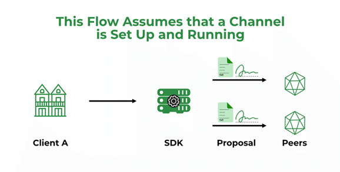
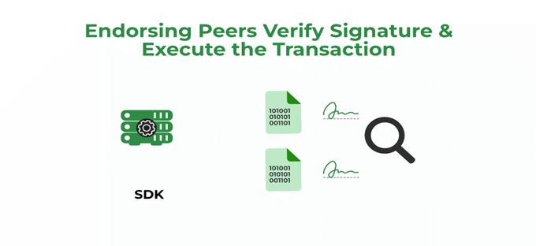
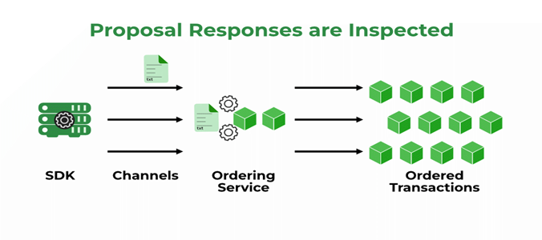
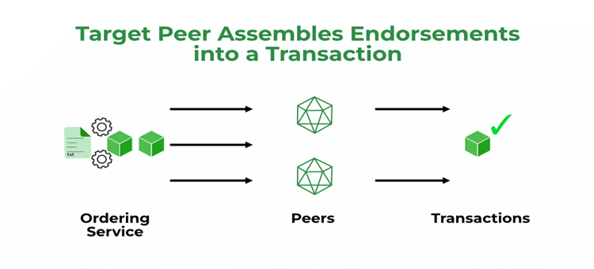
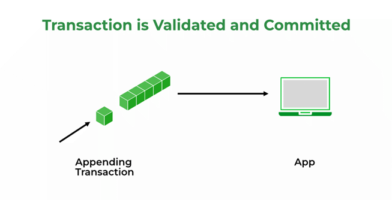
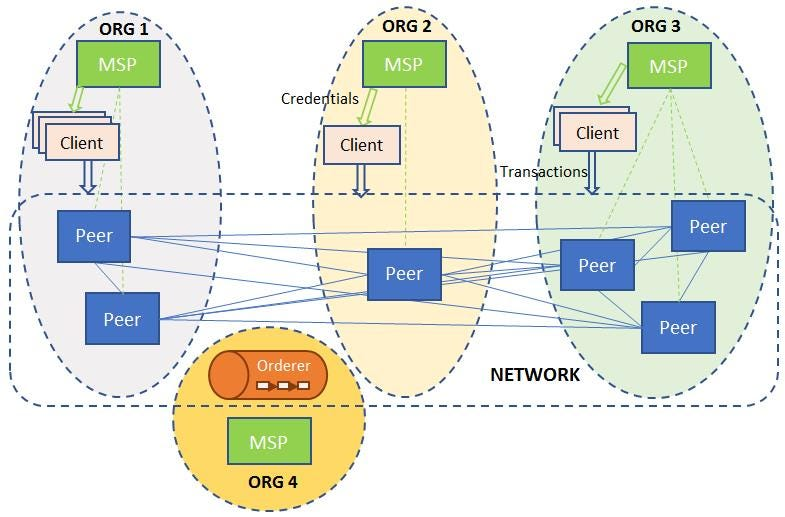

# Hyperledger 

Hyperledger is an open-source project under the Linux Foundation dedicated to developing blockchain-related use cases across various industrial sectors. It supports the creation of blockchain-based distributed ledgers and provides infrastructure for developing enterprise-ready, permissioned blockchain platforms.

**Key Features:**
- **Supports Blockchain Development:** Focuses on creating blockchain-based distributed ledgers.
- **Enterprise-Ready Platforms:** Includes various permissioned blockchain platforms.
- **Global Collaboration:** Aims to develop high-performance and reliable blockchain and distributed ledger technology frameworks.

**Benefits:**
- **Enhanced Efficiency:** Improves the efficiency, performance, and transactions of business processes.
- **Infrastructure and Standards:** Provides necessary infrastructure and standards for industrial blockchain-based systems and applications.
- **Simplification of Agreements:** Reduces complexity in contractual agreements by addressing legal issues.
- **Data Security:** Offers physical separation of sensitive data.
- **Trust and Scalability:** Enhances trust, optimizes network performance, and scalability by reducing verification needs.


# Hyper Ledger Fabric Architecture


Hyperledger Fabric is a modular blockchain framework that provides a robust and flexible architecture for enterprise use. It consists of several key components that work together to provide a secure and efficient blockchain solution.


### Key Components of Hyperledger Fabric

1.  **Membership Service Provider (MSP)**
    
    *   The MSP is responsible for managing identities in the network. It issues and validates certificates to ensure only authorized participants can join the network.
2.  **Ledger**
    
    *   The ledger in Hyperledger Fabric consists of two parts: the world state and the blockchain.
        *   **World State**: A database that holds the current state of ledger data as key-value pairs.
        *   **Blockchain**: A transaction log that records all the changes to the world state, ensuring immutability.
3.  **Peers**
    
    *   Peers are the nodes in the network that maintain the ledger and execute smart contracts. They can have different roles:
        *   **Endorser**: Validates and signs transactions before they are committed to the ledger.
        *   **Committer**: Adds validated transactions to the ledger.
4.  **Ordering Service**
    
    *   This service ensures the proper sequencing of transactions and creates blocks to be added to the blockchain. It decouples the transaction ordering from the actual transaction processing, enhancing scalability and performance.
5.  **Channels**
    
    *   Channels provide a way to partition the network into sub-networks, allowing transactions to be visible only to parties involved in those transactions. Each channel has its own ledger.
6.  **Smart Contracts (Chaincode)**
    
    *   Smart contracts, written in chaincode, define the business logic that is executed by the peers. They are responsible for generating new facts to be added to the ledger.


# Transaction Flow in Hyperledger Fabric

### Step-by-Step Explanation

1.  ### Client Initiates a Transaction:  
    
    *   **Client A** sends a request to **Client B** to purchase goods (e.g., radishes).
    *   The request targets **Peer A** and **Peer B**, who represent **Client A** and **Client B** respectively.
    *   The endorsement policy requires both peers to endorse the transaction, so the request goes to both **Peer A** and **Peer B**.
    *   A transaction proposal, which is a request to invoke a chaincode function to read or update the ledger, is constructed using the Software Development Kit (SDK).
    *   The SDK uses the user’s cryptographic credentials to produce a unique signature for the transaction proposal.
    *   The SDK submits the transaction proposal to the target peer, which forwards it to other peers for execution.

  
2.  ### Endorsing Peers Verify the Signature and Execute the Transaction:  
    
    *   The endorsing peers verify:
        *   The transaction proposal is well-formed.
        *   The transaction proposal has not been submitted before to protect against replay attacks.
        *   The signature is valid.
        *   The submitter (Client A) satisfies the channel’s writers’ policy and is authorized to perform the proposed operation on the channel.
  
3.  ### Proposal Responses are Inspected:  
    
    *   The target peer verifies the proposal responses.
    *   Even if checking is not performed, the Hyperledger Fabric architecture ensures that the endorsement policy is checked and enforced when each peer validates transactions before committing them.
  
4.  ### Target Peer Assembles Endorsements into a Transaction:  
    
    *   The target peer broadcasts transaction messages containing transaction proposals and responses to the ordering service. This includes:
        *   Channel ID
        *   Read/Write sets
        *   A signature for each endorsing peer
    *   The ordering service receives the transactions, orders them, and creates blocks of transactions per channel. It does not inspect the entire content of the transaction.

5.  ### Transaction is Validated and Committed:  
    
    *   Blocks of transactions are delivered to all peers on the channel.
    *   Peers validate the transactions within the block to ensure the endorsement policy is fulfilled.
    *   Validated transactions are then committed to the ledger. 


# Hyperledger Fabric Details

### Introduction

Hyperledger Fabric is a permissioned blockchain infrastructure, initially developed by IBM, that offers a modular architecture. It is designed for enterprise use cases, enabling the development of blockchain-based distributed ledger applications.

### Key Components

1.  **Membership Service Provider (MSP):**
    
    *   MSP is the mechanism that defines the rules for validating identities on the network.
    *   It involves the issuance of identities by Certificate Authorities (CAs) and ensures that these identities are recognized by the network.
2.  **Ledger:**
    
    *   The ledger in Hyperledger Fabric consists of two components:
        *   **World State:** A database that holds the current values of a set of ledger states, expressed as key-value pairs.
        *   **Blockchain:** An immutable transaction log that records all the changes that have resulted in the current world state.
3.  **Channel:**
    
    *   Channels provide a way for multiple stakeholders to share a common view of a ledger.
    *   Each channel has a separate ledger, allowing for private and confidential transactions among participants.
4.  **Peer Nodes:**
    
    *   Peers maintain the ledger and execute smart contracts (chaincode).
    *   Peers can take on two roles:
        *   **Endorser:** Simulates and signs transactions.
        *   **Committer:** Validates and commits transactions to the ledger.
5.  **Ordering Service:**
    
    *   Responsible for ordering transactions and creating blocks.
    *   Ensures the consistency of the blockchain by delivering the same order of transactions to all peers.
6.  **Smart Contracts and Chaincode:**
    
    *   Smart contracts define the business logic that is executed during transactions.
    *   Chaincode is the term used for smart contracts in Hyperledger Fabric and is deployed on the network.

### Hyperledger Technology Layers

1.  **Consensus Layer:**
    
    *   Manages the agreement on the order and correctness of transactions within a block.
2.  **Smart Contract Layer:**
    
    *   Handles the processing of transaction requests and the authorization of valid transactions.
3.  **Communication Layer:**
    
    *   Manages peer-to-peer message transport.
4.  **Identity Management Services:**
    
    *   Establish trust on the blockchain by managing identities.
5.  **API Layer:**
    
    *   Allows external applications and clients to interact with the blockchain.

### Benefits of Hyperledger Fabric

1.  **Permissioned Network:**
    
    *   Provides a higher level of security and trust by restricting access to the network.
2.  **Confidential Transactions:**
    
    *   Ensures privacy through data partitioning and channels.
3.  **Modular Architecture:**
    
    *   Allows for the customization and flexibility needed for various enterprise use cases.
4.  **Performance and Scalability:**
    
    *   Optimized for high performance and scalable solutions.

### Limitations of Hyperledger Fabric

1.  **Complex Architecture:**
    
    *   The sophisticated design can be challenging to implement and manage.
2.  **Limited Developer Resources:**
    
    *   Compared to other blockchain platforms, there may be fewer developers proficient in Hyperledger Fabric.
3.  **Fewer Use Cases:**
    
    *   While growing, the number of use cases and industry adoption is still developing.

### Applications of Hyperledger Fabric

1.  **Finance:**
    
    *   Streamlines transaction settlements and enhances transparency.
2.  **Healthcare:**
    
    *   Improves patient care and data accessibility while reducing costs.
3.  **Supply Chain:**
    
    *   Increases traceability and reduces counterfeit goods.
4.  **Insurance:**
    
    *   Speeds up claim processing and automates payments through smart contracts.
5.  **Digital Payments:**
    
    *   Enhances cross-border payment processes and reduces costs.
  


# Hyperledger Fabric MSP

Hyperledger Fabric's Membership Service Providers (MSPs) are a crucial component for managing identities within the blockchain network. The MSP is responsible for defining and controlling the rules by which entities (e.g., clients, peers) are authenticated and granted access to the system. MSPs abstract away the details of cryptographic mechanisms and protocols used for identity validation, making the implementation of security policies more straightforward.

Key aspects of Hyperledger Fabric MSP:

1. **Identity Issuance and Validation**: MSPs provide a way to generate, issue, and validate cryptographic identities (digital certificates) using a Public Key Infrastructure (PKI). MSPs take care of issuing certificates to establish trusted identities and verifying them during transaction processing.

2. **Organizational Units**: MSPs can represent different organizational units within the network, allowing for fine-grained control over membership. Each organization within a Fabric network typically has its own MSP, which manages the identities of its members.

3. **Certificates and Revocation**: MSPs store and manage the certificates of the entities in the network. They also handle the revocation of certificates when identities should no longer have access, ensuring that only legitimate actors can participate.

4. **Root CAs and Intermediate CAs**: MSPs can utilize root Certificate Authorities (CAs) and intermediary CAs to establish a hierarchical structure for identity trust chains. This allows for scalable and secure identity management.


# Identity Management in Hyperledger Fabric

Identity management in Hyperledger Fabric is underpinned by the MSP's capabilities to handle the complexities of digital certificates and cryptographic identities. This encompasses several key processes and components:

1. **Certificate Authorities (CAs)**:
    - Fabric leverages CAs for issuing digital identities. There are two primary types of CAs in Fabric:
      - **Root CAs**: These are the top-level CAs that sign the certificates of intermediate CAs and directly issue certificates to end entities.
      - **Intermediate CAs**: These are subordinate CAs that can issue certificates under the authority of a root CA, facilitating a hierarchical trust model.
    - Identity issuance involves generating key pairs and obtaining certificates from the CA.

2. **User Enrollment and Registration**:
    - New users (clients or admin identities) must register with the CA to be issued a digital certificate. This involves associating their public key with their identity and obtaining a signed certificate from the CA.

3. **Identity Storage**:
    - Digital certificates and associated keys are stored securely. This storage can be within the user’s local file system or more secure hardware solutions like Hardware Security Modules (HSMs).

4. **Role-Based Access Control (RBAC)**:
    - RBAC mechanisms allow organizations to define roles for their members. These roles are often encoded in the certificates allowing for the enforcement of access policies and permissions according to organizational rules.

5. **Certificate Revocation Lists (CRLs)**:
    - Hyperledger Fabric respects standard PKI practices, including the use of CRLs. When a certificate is revoked, it is added to a CRL, ensuring that it is no longer considered valid by the peers and network participants.


# Hyperledger Fabric Libraries

**Hyperledger Indy**
Hyperledger Indy is a blockchain-based project designed specifically for decentralized identity management. It provides tools, libraries, and reusable components for creating and using independent digital identities rooted on blockchains or other distributed ledgers for interoperability.

Key Features:
- **Decentralized Identity**: Supports self-sovereign identity to give individuals control over their digital identity.
- **Verifiable Credentials**: Allows issuing and verifying credentials cryptographically.
- **Interoperability**: Designed to work with other Hyperledger projects and beyond.

**Hyperledger Aries**
Hyperledger Aries is a shared, reusable, and interoperable toolkit for creating, transmitting, and storing verifiable digital credentials.

Key Features:
- **Protocols**: Defines protocols for secure communication, enabling peer-to-peer interactions.
- **Wallets and Agents**: Provides libraries for building local key management services and agents that handle messages.
- **Interoperability**: Supports secure and interoperable identity systems, working in conjunction with Hyperledger Indy and others.

**Hyperledger Caliper**
Hyperledger Caliper is a blockchain performance benchmark tool, allowing users to measure the performance of a specific blockchain implementation with a set of predefined use cases.

Key Features:
- **Performance Measurement**: Provides metrics like transaction throughput, latency, resource utilization.
- **Interoperability**: Can be used to benchmark different blockchain platforms, including Hyperledger Fabric, Ethereum, and others.
- **Modular Design**: Users can define and run their own test cases and integrate with CI/CD pipelines.

**Hyperledger Quilt**
Hyperledger Quilt offers interoperability between ledger systems by implementing the Interledger protocol (ILP), which enables transferring value across different distributed and non-distributed ledgers.

Key Features:
- **Cross-Ledger Transactions**: Facilitates transactions across various blockchain networks seamlessly.
- **Interledger Protocol (ILP)**: Uses ILP to support multi-currency, multi-ledger payments.
- **Atomic Swaps**: Ensures atomicity in transactions to prevent failures in cross-ledger transfers.

**Hyperledger Ursa**
Hyperledger Ursa is a shared cryptographic library intended to be used across different Hyperledger projects to avoid duplicating cryptographic effort and reduce vulnerability risks.

Key Features:
- **Modular Cryptographic Algorithms**: Includes a wide range of cryptographic algorithms and protocols.
- **Interoperability**: Designed to be usable by all Hyperledger projects.
- **Expert Review**: Centralizes cryptographic expertise to improve security across projects.


# Step-by-Step Guide to Setting Up a Hyperledger Fabric Network

Setting up a Hyperledger Fabric network involves several steps, each crucial for deploying a decentralized blockchain network capable of supporting distributed applications (dApps). Here’s a step-by-step guide along with a diagram to illustrate the process:

**1. Install Prerequisites:**
   Before setting up the Fabric network, ensure you have all the necessary prerequisites installed, including Docker, Docker Compose, Go, jq, Node.js (optional for some tasks), and Java (for SDKs if needed).

**2. Clone Fabric-Samples Repository:**
   Clone the Fabric-Samples repository from GitHub, which contains essential scripts and configurations to deploy Fabric networks and run sample applications.

   ```
   git clone https://github.com/hyperledger/fabric-samples.git
   cd fabric-samples
   ```

**3. Generate Network Artifacts:**
   Navigate to the test-network directory within fabric-samples, where you can generate the necessary cryptographic materials, configuration files, and Docker images needed for your Fabric network.

   ```
   cd test-network
   ./network.sh down
   ./network.sh up
   ```

   The `network.sh` script handles the creation and teardown of your Fabric network. It uses Docker Compose to manage containers for peers, orderers, and other network components.

**4. Create and Join Channels:**
   Once the network is up, you can create channels where transactions will be executed and validated. Use the `network.sh` script to create and join channels between nodes.

   ```
   ./network.sh createChannel
   ./network.sh joinChannel
   ```

   This step establishes communication channels between nodes (peers) in the network to facilitate transaction processing.

**5. Install and Instantiate Chaincode:**
   Chaincode (smart contracts) defines the business logic of your applications on the Fabric network. Install and instantiate chaincode on peers to enable transaction processing.

   ```
   ./network.sh deployCC
   ```

   This command deploys a sample chaincode onto the peers and makes it ready for invoking transactions.

**6. Interact with the Network:**
   Once the network is set up, you can interact with it using SDKs (Node.js, Java, etc.) or command-line tools provided by Fabric-Samples to invoke transactions, query ledger data, and monitor network status.

**7. Shut Down the Network:**
   After testing or development, use the `network.sh` script to shut down the network and clean up artifacts.

   ```
   ./network.sh down
   ```

   This command stops and removes containers, networks, and volumes associated with the Fabric network.


