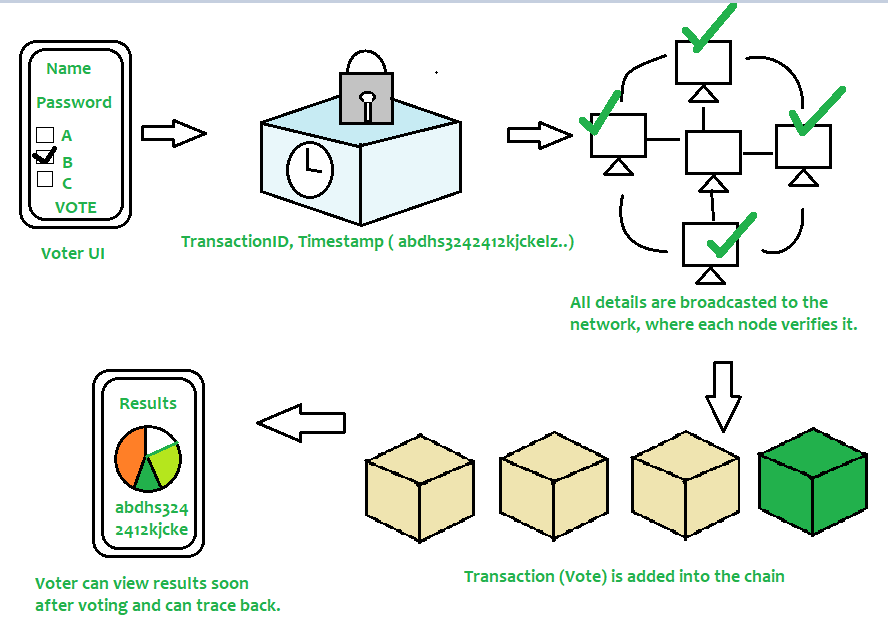
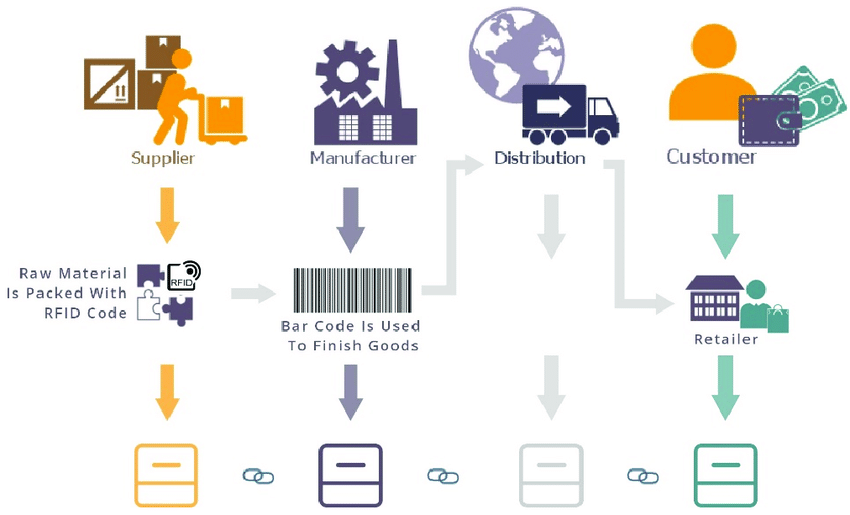

# Non Fungible Tokens (NFTs)

Non-Fungible Tokens (NFTs) have emerged as a significant innovation within the realm of blockchain technology, offering unique digital representations of assets that are distinct from traditional cryptocurrencies like Bitcoin or Ethereum. 

### What are NFTs?

NFTs are cryptographic tokens that exist on a blockchain and are used to represent ownership or proof of authenticity of a unique item or asset. Unlike cryptocurrencies such as Bitcoin, which are fungible (each unit is interchangeable with another), NFTs are non-fungible, meaning each token is unique and cannot be replaced by another token.

### How do NFTs work?

1. **Creation (Minting)**: NFTs are created through a process called minting, where unique information about the asset is recorded onto a blockchain. This process typically involves the use of smart contracts, which automate ownership verification and manage the transferability of the NFTs.

2. **Ownership**: Each NFT is associated with a specific owner, and ownership information is publicly available on the blockchain. This transparency helps establish authenticity and provenance of the digital asset.

3. **Unique Identification**: Every NFT has a distinct identifier and metadata that sets it apart from other tokens, even if they represent the same underlying asset (e.g., different digital artworks).

### Applications and Use Cases of NFTs

- **Digital Art and Collectibles**: Artists tokenize their work as NFTs, granting unique ownership and enabling direct monetization.
  
- **Real-World Assets**: NFTs extend to physical assets like real estate and intellectual property, simplifying transactions and enhancing security.
  
- **Entertainment and Gaming**: NFTs in gaming represent in-game items and virtual land, facilitating true ownership and transfer within game ecosystems.
  
- **Identity and Security**: NFTs can serve as secure digital certificates, verifying identity and credentials in sectors such as education and healthcare.

### Benefits of NFTs

- **Authenticity and Provenance**: Blockchain ensures each NFT is unique and verifiable, reducing risks of counterfeit items.
  
- **Market Efficiency**: Asset tokenization streamlines transactions, cutting costs and paperwork by eliminating intermediaries.
  
- **Fractional Ownership**: NFTs enable multiple investors to own shares of high-value assets, democratizing investment opportunities.
  
- **Creative Freedom and Monetization**: Artists monetize their work directly through NFTs, creating new revenue streams and engaging with audiences.

### Challenges and Considerations

- **Environmental Impact**: Blockchain transactions, especially on energy-intensive networks, raise sustainability concerns.
  
- **Market Volatility**: NFT valuations can be speculative, influenced by trends, endorsements, and social media.
  
- **Regulatory Uncertainty**: Governments are navigating NFT regulation, addressing issues like taxation and intellectual property.


# Decentralized Autonomous Organizations (DAOs)

A DAO is a decentralized, autonomous entity managed entirely by pre-defined rules and protocols coded into smart contracts on a blockchain. It operates autonomously, without the need for a central authority or intermediaries. DAOs leverage blockchain's transparency and immutability to ensure trust and accountability among participants.

### Key Components of DAOs
1. **No Central Legal Entity**: Unlike traditional organizations, DAOs have no centralized legal structure. They exist solely on the blockchain, governed by smart contracts and community consensus.
   
2. **Self-Enforcing Code**: Smart contracts within DAOs automate operations and enforce rules without human intervention, ensuring transparency and eliminating the need for intermediaries.

3. **Token-based Incentives**: DAOs use tokens as incentives for participants (validators) who contribute to the network's operations. Tokens often confer voting rights and are integral to governance within DAOs.

### How DAOs Operate


1. **Smart Contract Creation**: DAOs begin with the creation of smart contracts that define the organization’s rules and governance processes. These contracts are rigorously tested to ensure security and functionality.

2. **Funding Mechanisms**: DAOs typically raise funds by issuing tokens, which are sold to investors or users. These tokens confer ownership and governance rights, allowing stakeholders to participate in decision-making.

3. **Deployment on Blockchain**: Once operational, DAOs are deployed on a blockchain, where they operate autonomously according to the rules encoded in their smart contracts. Decisions are made through decentralized voting mechanisms.

### Examples of DAO Applications
- **Digital Currencies**: Examples like Dash demonstrate DAO principles by governing protocol updates and treasury management through decentralized decision-making.
  
- **Charitable Organizations**: DAOs can manage donations transparently, allowing donors to vote on how funds are allocated to different causes.
  
- **Consulting Firms**: DAOs of contractors can pool resources for shared office spaces and tools, with decisions made collectively through voting.

### Advantages of DAOs
- **Decentralization**: Promotes collective decision-making and reduces dependence on central authorities.
  
- **Community Driven**: Facilitates global collaboration and inclusivity in organizational governance.
  
- **Aligned Incentives**: Mitigates principal-agent problems by aligning stakeholders' interests through direct participation in governance.

### Challenges and Limitations
- **Security Concerns**: Vulnerabilities in smart contracts can lead to security breaches, requiring robust technical expertise.
  
- **Governance Efficiency**: Ensuring timely decision-making and consensus among global participants can be challenging.
  
- **Regulatory Uncertainty**: Legal frameworks for DAOs are still evolving, posing risks in terms of compliance and jurisdictional issues.


# Soulbound Tokens (SBTs)

Soulbound tokens are a type of non-fungible token (NFT) designed to be non-transferable and permanently tied to the owner's identity or "Soul." They are built on blockchain technology, ensuring authenticity and preventing replication. Unlike typical NFTs, which can be bought, sold, or transferred between wallets, SBTs are intended to stay with the individual or entity (Soul) that initially receives them.


### Characteristics of SBTs:
1. **Non-Transferable**: Once minted, SBTs cannot be transferred to another wallet. They are bound to the owner's Soul and cannot be sold or traded.
   
2. **Identity Representation**: SBTs encapsulate personal or entity-specific information such as characteristics, achievements, credentials, and other relevant data. They serve as immutable records on the blockchain.

3. **Authentication and Proof**: SBTs provide a reliable method for verifying identity, credentials, and ownership within decentralized ecosystems.

### History and Development

SBTs were initially conceptualized by Vitalik Buterin, co-founder of Ethereum, who drew inspiration from the concept of "Soulbound items" in online games like World of Warcraft. These items, once acquired, cannot be traded or sold to other players, aligning with the core principle of non-transferability in SBTs.

Later developments by Buterin, E. Glen Weyl, and Puja Ohlhaver expanded upon this concept in their paper "Decentralized Society: Finding web3’s soul," framing SBTs as foundational to decentralized identity in digital societies.

### Benefits of Soulbound Tokens

- **Digital Verification**: SBTs ensure authenticity and prevent forgery by binding personal data to a specific blockchain wallet.
  
- **Enhanced Trust and Reliability**: They facilitate trust in decentralized environments by providing transparent and immutable records of an individual's or organization's identity and credentials.
  
- **Improved Access and Efficiency**: Streamlines processes like job applications, educational verifications, and healthcare records management by eliminating intermediaries and paperwork.

- **Secure and Decentralized Governance**: Enhances voting processes in decentralized autonomous organizations (DAOs) by ensuring that voting rights are tied to genuine, committed stakeholders rather than being easily tradable.

- **Use in Metaverse and NFT Ecosystem**: Verifies the authenticity of NFTs tied to artists' identities, preventing fraud and ensuring buyers receive legitimate products.

### Use Cases of Soulbound Tokens

1. **Education**: Issuing and verifying educational credentials and qualifications securely on the blockchain.
  
2. **Employment**: Storing and sharing work histories, skills, and certifications transparently for job applications and career progression.

3. **Healthcare**: Managing and sharing medical records securely, facilitating seamless transitions between healthcare providers.

4. **Government Services**: Issuing digital IDs, driver’s licenses, and other official documents that require proof of identity.

5. **Financial Services**: Enhancing credit checks and lending processes by securely sharing financial histories and records.

6. **NFT Verification**: Authenticating NFTs by linking them to their creators' SBTs, ensuring buyers receive genuine products in the NFT marketplace.

7. **Governance in DeFi**: Distributing governance tokens as non-transferable SBTs to ensure voting rights reflect genuine community support and commitment.


> Unsure exaple of a Soulbound Token Solidity Program

```js
// SPDX-License-Identifier: MIT
pragma solidity ^0.8.0;

contract SoulBoundToken {
    mapping(address => uint256) public soulTokens;

    function mintToken(uint256 amount) public {
        soulTokens[msg.sender] += amount;
    }

    function transferToken(address to, uint256 amount) public {
        require(soulTokens[msg.sender] >= amount, "Insufficient tokens");
        soulTokens[msg.sender] -= amount;
        soulTokens[to] += amount;
    }

    function getBalance(address account) public view returns (uint256) {
        return soulTokens[account];
    }
}
```


# Zero Knowledge Proof (ZKP)

**Definition:**
Zero Knowledge Proof (ZKP) is an encryption scheme originally proposed by MIT researchers Shafi Goldwasser, Silvio Micali, and Charles Rackoff in the 1980s. It allows one party, the prover, to prove to another party, the verifier, that a statement is true without revealing any additional information beyond the validity of the statement itself.

**Examples:**

1. **Colour-blind friend and Two balls:**
   - **Scenario:** Sachin wants to prove to Sanchita, who is colour blind, that he has two balls of different colours.
   - **Process:** Sanchita randomly switches the balls behind her back. Sachin, without knowing the switch, must correctly identify if the balls are of different colours.
   - **Outcome:** If repeated multiple times, the probability of Sachin correctly identifying the balls' colours, despite being colour-blind, demonstrates the soundness of his assertion without revealing the colours themselves.

2. **Finding Waldo:**
   - **Scenario:** Sachin claims he has a special way to find Waldo in a crowded picture but doesn't want to reveal his method to Sanchita.
   - **Process:** Sachin uses a small cardboard cutout to show Sanchita that he can precisely locate Waldo in the picture.
   - **Outcome:** Sanchita can verify that Sachin can find Waldo without knowing how he does it.

    In essence, Sachin demonstrates his ability without revealing the details of his method, proving the effectiveness of his claim to Sanchita.

**Properties of ZKP:**

- **Zero-Knowledge:** The verifier learns nothing about the statement other than its truthfulness.
- **Completeness:** If the statement is true, an honest verifier will eventually be convinced by the prover.
- **Soundness:** A dishonest prover cannot convince the verifier that a false statement is true.

**Types of ZKP:**

1. **Interactive Zero Knowledge Proof:**
   - Requires interaction between the prover and verifier.
   - Example: Sachin and Sanchita's ball experiment involves iterative interactions to prove the validity of Sachin's claim.

2. **Non-Interactive Zero Knowledge Proof:**
   - Does not require real-time interaction.
   - Achieved using techniques like Fiat-Shamir heuristic, where challenges are based on a hashed function chosen by the verifier.
   - Example: Sachin demonstrating his algorithm to find Waldo without Sanchita needing to interact in real-time.


# DAO vs. Traditional Organization

| Topic                                             | DAO                                             | Traditional Organizations                               |
|---------------------------------------------------|-------------------------------------------------|---------------------------------------------------------|
| **Decisions and Voting**                          | Decisions require voting by participants for any changes to be implemented. | Depending on the organizational structure, changes may be initiated by a governing body or stakeholders, with or without a voting process. |
| **Execution of Decisions**                        | Votes are counted and results are executed automatically without a trusted intermediary. | Voting outcomes, if conducted, are manually tallied and implemented by administrative staff or designated authorities. |
| **Democratic vs Hierarchical Decision-Making**    | Fully democratized decision-making process where all participants have equal voting rights. | Decision-making is often hierarchical, with decisions influenced by top-level management or governing bodies. |
| **Governance and Transparency**                   | Governance and operations are transparent and auditable due to decentralized protocols and smart contracts. | Governance and operations are centralized, relying on human oversight and management, which may lack transparency. |
| **Changes and Protocol Updates**                  | Changes to protocols or rules are enacted based on consensus among stakeholders. | Changes may require approval from a central authority or board of directors, potentially leading to delays or bureaucratic hurdles. |
| **Financial and Resource Management**             | Financial transactions and resource allocation are managed automatically through smart contracts. | Financial transactions and resource allocation are managed manually or through centralized systems prone to inefficiencies and errors. |
| **Ownership and Control**                         | Participants in DAOs have direct ownership and control over organizational decisions and resources. | Ownership and control in traditional organizations are typically held by shareholders or a small group of executives, limiting participation and influence. |
| **Vulnerabilities and Security**                  | Vulnerable to smart contract bugs or vulnerabilities in decentralized protocols. | Vulnerable to human error, fraud, and internal conflicts due to centralized control and management. |
| **Trustlessness and Autonomy**                    | Emphasizes trustlessness and autonomy in decision-making and operations. | Relies on trust in centralized authorities or management for decision-making and operational management. |
| **Innovation and Adaptability**                   | Encourages innovation and experimentation due to its decentralized and flexible nature. | Innovation and change may be slow due to bureaucratic processes and resistance to organizational shifts. |


# Use Case: Blockchain-Based E-Voting with Solidity Program

Blockchain technology offers promising solutions for enhancing transparency, security, and trust in various applications, including electronic voting (e-voting). Here’s a detailed discussion on how blockchain, specifically using Solidity programming language for smart contracts on platforms like Ethereum, can be utilized for e-voting systems:

**1. Overview of Blockchain-Based E-Voting:**

Blockchain provides a decentralized and immutable ledger where transactions (votes, in this case) are recorded securely and transparently. This technology addresses common challenges in traditional voting systems such as fraud, manipulation, and lack of transparency.

**2. Components of the Solution:**

- **Blockchain Platform:** Ethereum is commonly used due to its smart contract capabilities and the ability to execute decentralized applications (dApps).
- **Smart Contracts:** Written in Solidity, these are self-executing contracts with predefined rules and logic governing the voting process.
- **Decentralized Application (dApp):** The frontend interface that interacts with the blockchain network, allowing voters to cast their votes securely.

**3. How It Works:**



- **Voter Registration:** Voters are registered on the blockchain with unique digital identities tied to their public keys.
- **Vote Casting:** Voters use their private keys to cast votes securely through the dApp. Each vote transaction is recorded on the blockchain.
- **Vote Counting:** Votes are tallied in real-time as transactions are confirmed on the blockchain. Once recorded, votes cannot be altered or deleted.
- **Result Declaration:** Results are publicly accessible and verifiable by anyone with access to the blockchain, ensuring transparency.

**4. Benefits of Blockchain-Based E-Voting:**

- **Security:** Votes are cryptographically secured and tamper-proof due to blockchain’s consensus mechanism.
- **Transparency:** All transactions (votes) are transparent and auditable by stakeholders, reducing concerns about fraud.
- **Accessibility:** Enables remote voting, increasing voter turnout and accessibility for geographically dispersed populations.
- **Trust:** Enhances trust in the electoral process by eliminating intermediaries and providing a transparent record of votes.

**5. Implementation Using Solidity:**

- **Smart Contract Development:** Solidity is used to define the voting rules, manage voter eligibility, and handle vote counting.
- **Testing and Deployment:** Rigorous testing of smart contracts is essential to ensure security and functionality before deployment on the mainnet.


# Miscalleous Notes

**a) Para Chains:**
Para chains, short for "parallel chains," are specialized blockchains in the Polkadot network that run in parallel to the main relay chain. They are designed to provide scalability and flexibility by allowing different blockchains to operate independently yet connect to the Polkadot ecosystem. Para chains can have their own governance, consensus mechanisms, and token economies while benefiting from the security and interoperability provided by Polkadot's relay chain.

**b) Substrate Blockchain:**
Substrate is a blockchain development framework created by Parity Technologies. It provides a modular framework for building custom blockchains with specific functionalities tailored to different use cases. Substrate offers developers the ability to customize consensus mechanisms, token economics, and governance models without starting from scratch. It simplifies the process of creating blockchain projects by providing pre-built modules that can be easily integrated and customized according to project requirements.

**c) Dune Analytics:**
Dune Analytics is a decentralized data analytics platform focused on Ethereum and other blockchain networks. It allows users to explore, query, and visualize on-chain data in real-time without requiring a centralized database. Dune Analytics enables users to create custom queries, build dashboards, and share insights based on blockchain data. It supports transparency and accountability by providing access to publicly available blockchain data for analysis and research purposes.

**Layer-2 Protocols: Optimism and ZK-Rollups**

**Optimism:**
Optimism is a layer-2 scaling solution for Ethereum that aims to improve transaction throughput and reduce costs by leveraging optimistic rollups. It achieves scalability by processing transactions off-chain and periodically submitting batches of transactions to the Ethereum mainnet. Optimism uses optimistic rollups to verify transaction validity on-chain, ensuring security while significantly increasing transaction throughput compared to the Ethereum mainnet.

**ZK-Rollups:**
ZK-Rollups (Zero-Knowledge Rollups) are another layer-2 scaling solution for Ethereum that enhances scalability and reduces transaction costs. ZK-Rollups achieve this by aggregating multiple transactions into a single proof, which is then verified on-chain. This approach utilizes zero-knowledge proofs to ensure the validity of transactions without revealing their details, thereby maintaining privacy and reducing the computational load on the Ethereum mainnet. ZK-Rollups are considered a promising solution for enhancing Ethereum's scalability while maintaining security and decentralization.


# Use Case: Certificate Management with Solidity Program

In the context of blockchain technology, particularly using Solidity programming language on platforms like Ethereum, certificate management can be effectively implemented. Here’s how a Solidity program can be used for certificate management:

**1. Overview:**

Certificate management involves issuing, verifying, and managing certificates in a secure and tamper-proof manner. Blockchain technology, with its immutability and transparency, is well-suited for this use case to prevent certificate fraud, ensure authenticity, and streamline verification processes.

**2. Components of the Solution:**

- **Smart Contracts:** Written in Solidity, smart contracts act as self-executing agreements with predefined rules and logic governing certificate issuance, verification, and management.
  
- **Decentralized Application (dApp):** Provides an interface for users (issuers, recipients, and verifiers) to interact with the blockchain network for certificate-related operations.

- **Blockchain Network:** Utilizes Ethereum or another blockchain platform to store certificates securely on-chain, ensuring data integrity and accessibility.

**3. How It Works:**

- **Certificate Issuance:** Authorized issuers (e.g., educational institutions, training providers) can deploy a smart contract to issue certificates. Each certificate is represented as a unique token or NFT (Non-Fungible Token) on the blockchain.
  
- **Certificate Attributes:** Smart contracts can define attributes such as certificate type, recipient details, issuer information, issue date, and any other relevant metadata.

- **Certificate Verification:** Recipients or third parties can verify the authenticity of certificates by querying the blockchain. The decentralized nature of blockchain ensures that certificates cannot be altered or falsified once recorded.

- **Immutable Record:** Once a certificate is issued and recorded on the blockchain, it becomes part of an immutable ledger, providing a transparent and auditable history of certifications.

**4. Benefits:**

- **Security:** Certificates stored on the blockchain are cryptographically secured, eliminating risks of tampering or forgery.
  
- **Transparency:** All certificate-related transactions are transparent and auditable, enhancing trust and credibility in the certification process.
  
- **Efficiency:** Streamlines certificate issuance and verification processes, reducing administrative overhead and paperwork.
  
- **Accessibility:** Certificates can be accessed and verified globally, facilitating cross-border recognition and mobility.

**5. Implementation Using Solidity:**

- **Smart Contract Development:** Solidity is used to define the structure of certificates, manage issuance rules, implement verification logic, and handle interactions with certificate holders and verifiers.
  
- **User Interface:** A user-friendly dApp interface allows stakeholders to interact with the blockchain, submit certificate issuance requests, verify certificates, and manage their certificates.

**6. Example Scenario:**

- **Educational Certificates:** Universities issue academic certificates on the blockchain. Employers and academic institutions can verify the authenticity and validity of these certificates without relying on centralized authorities.


# Use Case: Marketplace and Supply Chain 

In the context of blockchain technology, integrating marketplaces with supply chain management can bring numerous benefits such as transparency, traceability, efficiency, and reduced costs. Here’s an explanation of how blockchain can be applied to this use case, illustrated with an example:



**1. Overview:**

A marketplace involves the buying and selling of goods or services between multiple parties, while supply chain management focuses on the procurement, production, logistics, and distribution of goods. Blockchain technology enhances these processes by providing a decentralized and immutable ledger that records transactions and movements of goods across the supply chain.

**2. Components of the Solution:**

- **Blockchain Network:** Utilizes a distributed ledger technology (DLT) such as Ethereum or Hyperledger Fabric, which ensures transparency, security, and traceability of transactions.

- **Smart Contracts:** Written in Solidity or another smart contract language, these automate and enforce agreements between parties (buyers, sellers, suppliers) in the marketplace and supply chain.

- **Decentralized Application (dApp):** Provides an interface for stakeholders (e.g., buyers, sellers, logistics providers) to interact with the blockchain network, track goods, place orders, and manage transactions.

**3. How It Works:**

- **Marketplace Transactions:** Buyers and sellers transact directly on the blockchain platform using cryptocurrencies or fiat currencies converted into digital tokens.

- **Supply Chain Integration:** Once a purchase is made, smart contracts trigger automated processes within the supply chain, such as order fulfillment, inventory management, and shipment tracking.

- **Traceability:** Each transaction and movement of goods (from manufacturing to delivery) is recorded on the blockchain, allowing stakeholders to trace the provenance and authenticity of products.

- **Smart Logistics:** IoT devices (e.g., RFID tags, sensors) can be integrated to monitor temperature, humidity, and location of goods in real-time, ensuring quality control and compliance with shipping regulations.

**4. Example Scenario:**

**Example: Agricultural Product Marketplace and Supply Chain**

- **Scenario:** A marketplace is established for buying and selling organic produce directly from farmers to consumers. The supply chain involves multiple stages from farm to table.

- **Implementation:**
  - **Farmers:** Use the marketplace to list their produce and set prices.
  - **Buyers:** Purchase products using cryptocurrencies or tokens.
  - **Smart Contracts:** Automate payment upon delivery and trigger logistics processes.
  - **Supply Chain:** Blockchain records each transaction, tracks inventory levels, monitors shipment conditions, and provides real-time updates to buyers and sellers.

- **Benefits:**
  - **Transparency:** Consumers can verify the origin and quality of products.
  - **Efficiency:** Automated processes reduce administrative costs and improve supply chain efficiency.
  - **Trust:** Immutable records enhance trust between parties, reducing fraud and disputes.
  - **Compliance:** Ensures compliance with organic certification and food safety standards.
