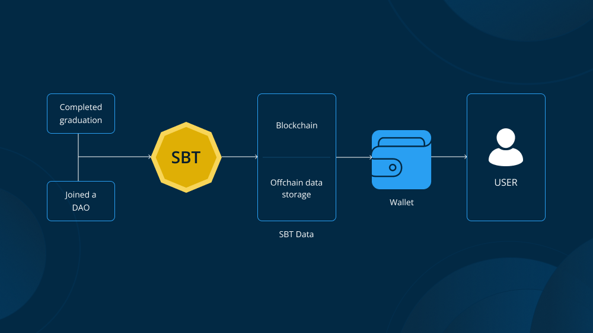

# Non Fungible Tokens (NFTs)

Non-Fungible Tokens (NFTs) have emerged as a significant innovation within the realm of blockchain technology, offering unique digital representations of assets that are distinct from traditional cryptocurrencies like Bitcoin or Ethereum. 

### What are NFTs?

NFTs are cryptographic tokens that exist on a blockchain and are used to represent ownership or proof of authenticity of a unique item or asset. Unlike cryptocurrencies such as Bitcoin, which are fungible (each unit is interchangeable with another), NFTs are non-fungible, meaning each token is unique and cannot be replaced by another token.

### How do NFTs work?

1. **Creation (Minting)**: NFTs are created through a process called minting, where unique information about the asset is recorded onto a blockchain. This process typically involves the use of smart contracts, which automate ownership verification and manage the transferability of the NFTs.

2. **Ownership**: Each NFT is associated with a specific owner, and ownership information is publicly available on the blockchain. This transparency helps establish authenticity and provenance of the digital asset.

3. **Unique Identification**: Every NFT has a distinct identifier and metadata that sets it apart from other tokens, even if they represent the same underlying asset (e.g., different digital artworks).

### Applications and Use Cases of NFTs

- **Digital Art and Collectibles**: Artists tokenize their work as NFTs, granting unique ownership and enabling direct monetization.
  
- **Real-World Assets**: NFTs extend to physical assets like real estate and intellectual property, simplifying transactions and enhancing security.
  
- **Entertainment and Gaming**: NFTs in gaming represent in-game items and virtual land, facilitating true ownership and transfer within game ecosystems.
  
- **Identity and Security**: NFTs can serve as secure digital certificates, verifying identity and credentials in sectors such as education and healthcare.

### Benefits of NFTs

- **Authenticity and Provenance**: Blockchain ensures each NFT is unique and verifiable, reducing risks of counterfeit items.
  
- **Market Efficiency**: Asset tokenization streamlines transactions, cutting costs and paperwork by eliminating intermediaries.
  
- **Fractional Ownership**: NFTs enable multiple investors to own shares of high-value assets, democratizing investment opportunities.
  
- **Creative Freedom and Monetization**: Artists monetize their work directly through NFTs, creating new revenue streams and engaging with audiences.

### Challenges and Considerations

- **Environmental Impact**: Blockchain transactions, especially on energy-intensive networks, raise sustainability concerns.
  
- **Market Volatility**: NFT valuations can be speculative, influenced by trends, endorsements, and social media.
  
- **Regulatory Uncertainty**: Governments are navigating NFT regulation, addressing issues like taxation and intellectual property.

# Decentralized Autonomous Organizations (DAOs)

A DAO is a decentralized, autonomous entity managed entirely by pre-defined rules and protocols coded into smart contracts on a blockchain. It operates autonomously, without the need for a central authority or intermediaries. DAOs leverage blockchain's transparency and immutability to ensure trust and accountability among participants.

### Key Components of DAOs
1. **No Central Legal Entity**: Unlike traditional organizations, DAOs have no centralized legal structure. They exist solely on the blockchain, governed by smart contracts and community consensus.
   
2. **Self-Enforcing Code**: Smart contracts within DAOs automate operations and enforce rules without human intervention, ensuring transparency and eliminating the need for intermediaries.

3. **Token-based Incentives**: DAOs use tokens as incentives for participants (validators) who contribute to the network's operations. Tokens often confer voting rights and are integral to governance within DAOs.

### How DAOs Operate

1. **Smart Contract Creation**: DAOs begin with the creation of smart contracts that define the organization’s rules and governance processes. These contracts are rigorously tested to ensure security and functionality.

2. **Funding Mechanisms**: DAOs typically raise funds by issuing tokens, which are sold to investors or users. These tokens confer ownership and governance rights, allowing stakeholders to participate in decision-making.

3. **Deployment on Blockchain**: Once operational, DAOs are deployed on a blockchain, where they operate autonomously according to the rules encoded in their smart contracts. Decisions are made through decentralized voting mechanisms.

### Examples of DAO Applications
- **Digital Currencies**: Examples like Dash demonstrate DAO principles by governing protocol updates and treasury management through decentralized decision-making.
  
- **Charitable Organizations**: DAOs can manage donations transparently, allowing donors to vote on how funds are allocated to different causes.
  
- **Consulting Firms**: DAOs of contractors can pool resources for shared office spaces and tools, with decisions made collectively through voting.

### Advantages of DAOs
- **Decentralization**: Promotes collective decision-making and reduces dependence on central authorities.
  
- **Community Driven**: Facilitates global collaboration and inclusivity in organizational governance.
  
- **Aligned Incentives**: Mitigates principal-agent problems by aligning stakeholders' interests through direct participation in governance.

### Challenges and Limitations
- **Security Concerns**: Vulnerabilities in smart contracts can lead to security breaches, requiring robust technical expertise.
  
- **Governance Efficiency**: Ensuring timely decision-making and consensus among global participants can be challenging.
  
- **Regulatory Uncertainty**: Legal frameworks for DAOs are still evolving, posing risks in terms of compliance and jurisdictional issues.

# Soulbound Tokens (SBTs)

Soulbound tokens are a type of non-fungible token (NFT) designed to be non-transferable and permanently tied to the owner's identity or "Soul." They are built on blockchain technology, ensuring authenticity and preventing replication. Unlike typical NFTs, which can be bought, sold, or transferred between wallets, SBTs are intended to stay with the individual or entity (Soul) that initially receives them.

### Characteristics of SBTs:
1. **Non-Transferable**: Once minted, SBTs cannot be transferred to another wallet. They are bound to the owner's Soul and cannot be sold or traded.
   
2. **Identity Representation**: SBTs encapsulate personal or entity-specific information such as characteristics, achievements, credentials, and other relevant data. They serve as immutable records on the blockchain.

3. **Authentication and Proof**: SBTs provide a reliable method for verifying identity, credentials, and ownership within decentralized ecosystems.

### History and Development

SBTs were initially conceptualized by Vitalik Buterin, co-founder of Ethereum, who drew inspiration from the concept of "Soulbound items" in online games like World of Warcraft. These items, once acquired, cannot be traded or sold to other players, aligning with the core principle of non-transferability in SBTs.

Later developments by Buterin, E. Glen Weyl, and Puja Ohlhaver expanded upon this concept in their paper "Decentralized Society: Finding web3’s soul," framing SBTs as foundational to decentralized identity in digital societies.

### Benefits of Soulbound Tokens

- **Digital Verification**: SBTs ensure authenticity and prevent forgery by binding personal data to a specific blockchain wallet.
  
- **Enhanced Trust and Reliability**: They facilitate trust in decentralized environments by providing transparent and immutable records of an individual's or organization's identity and credentials.
  
- **Improved Access and Efficiency**: Streamlines processes like job applications, educational verifications, and healthcare records management by eliminating intermediaries and paperwork.

- **Secure and Decentralized Governance**: Enhances voting processes in decentralized autonomous organizations (DAOs) by ensuring that voting rights are tied to genuine, committed stakeholders rather than being easily tradable.

- **Use in Metaverse and NFT Ecosystem**: Verifies the authenticity of NFTs tied to artists' identities, preventing fraud and ensuring buyers receive legitimate products.

### Use Cases of Soulbound Tokens

1. **Education**: Issuing and verifying educational credentials and qualifications securely on the blockchain.
  
2. **Employment**: Storing and sharing work histories, skills, and certifications transparently for job applications and career progression.

3. **Healthcare**: Managing and sharing medical records securely, facilitating seamless transitions between healthcare providers.

4. **Government Services**: Issuing digital IDs, driver’s licenses, and other official documents that require proof of identity.

5. **Financial Services**: Enhancing credit checks and lending processes by securely sharing financial histories and records.

6. **NFT Verification**: Authenticating NFTs by linking them to their creators' SBTs, ensuring buyers receive genuine products in the NFT marketplace.

7. **Governance in DeFi**: Distributing governance tokens as non-transferable SBTs to ensure voting rights reflect genuine community support and commitment.

# Zero Knowledge Proof (ZKP)

**Definition:**
Zero Knowledge Proof (ZKP) is an encryption scheme originally proposed by MIT researchers Shafi Goldwasser, Silvio Micali, and Charles Rackoff in the 1980s. It allows one party, the prover, to prove to another party, the verifier, that a statement is true without revealing any additional information beyond the validity of the statement itself.

**Examples:**

1. **Colour-blind friend and Two balls:**
   - **Scenario:** Sachin wants to prove to Sanchita, who is colour blind, that he has two balls of different colours.
   - **Process:** Sanchita randomly switches the balls behind her back. Sachin, without knowing the switch, must correctly identify if the balls are of different colours.
   - **Outcome:** If repeated multiple times, the probability of Sachin correctly identifying the balls' colours, despite being colour-blind, demonstrates the soundness of his assertion without revealing the colours themselves.

2. **Finding Waldo:**
   - **Scenario:** Sachin claims he has a special way to find Waldo in a crowded picture but doesn't want to reveal his method to Sanchita.
   - **Process:** Sachin uses a small cardboard cutout to show Sanchita that he can precisely locate Waldo in the picture.
   - **Outcome:** Sanchita can verify that Sachin can find Waldo without knowing how he does it.

    In essence, Sachin demonstrates his ability without revealing the details of his method, proving the effectiveness of his claim to Sanchita.

**Properties of ZKP:**

- **Zero-Knowledge:** The verifier learns nothing about the statement other than its truthfulness.
- **Completeness:** If the statement is true, an honest verifier will eventually be convinced by the prover.
- **Soundness:** A dishonest prover cannot convince the verifier that a false statement is true.

**Types of ZKP:**

1. **Interactive Zero Knowledge Proof:**
   - Requires interaction between the prover and verifier.
   - Example: Sachin and Sanchita's ball experiment involves iterative interactions to prove the validity of Sachin's claim.

2. **Non-Interactive Zero Knowledge Proof:**
   - Does not require real-time interaction.
   - Achieved using techniques like Fiat-Shamir heuristic, where challenges are based on a hashed function chosen by the verifier.
   - Example: Sachin demonstrating his algorithm to find Waldo without Sanchita needing to interact in real-time.

