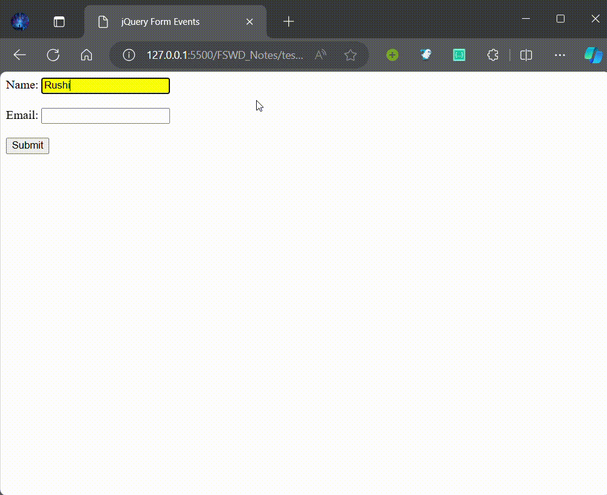
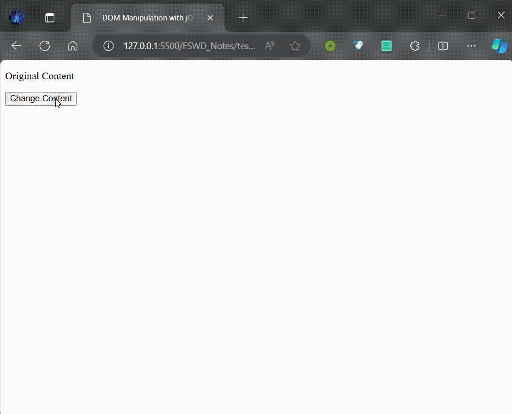
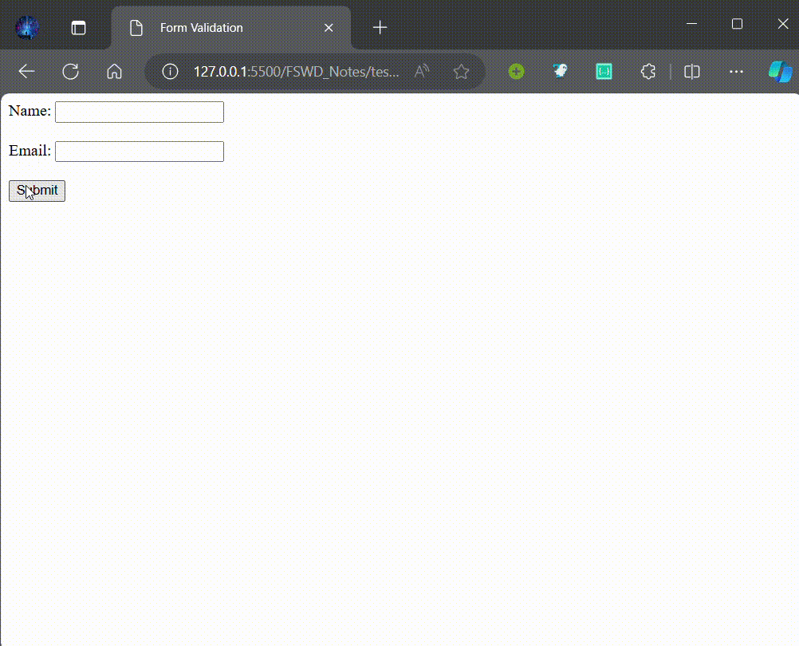

# JavaScript Variables and its Scope

In JavaScript, variables are used to store data values. They play a fundamental role in programming by allowing developers to manipulate and work with data dynamically. Variables in JavaScript are declared using the `var`, `let`, or `const` keywords.

**Scope:**
JavaScript has two types of scope: global scope and local scope. 

- **Global Scope:** Variables declared outside of any function have global scope, meaning they can be accessed from anywhere in the script. Global variables are accessible by all functions, including nested functions.

Example:
```javascript
var x = 10;

function myFunction() {
    var y = 20;
    console.log(x + y); // Output: 30
}
```

- **Local Scope:** Variables declared within a function have local scope, meaning they are only accessible within that function. Local variables are not accessible outside of the function in which they are declared.

Example:
```javascript
function myFunction() {
    var x = 10;
    var y = 20;
    console.log(x + y); // Output: 30
}

myFunction();
console.log(x + y); // Error: x is not defined, y is not defined
```

**Variable Declarations:**
- `var`: Before ES6, `var` was the primary way to declare variables in JavaScript. Variables declared with `var` are function-scoped, meaning they are accessible throughout the entire function in which they are declared.
- `let` and `const`: With the introduction of ES6 (ECMAScript 2015), `let` and `const` were added as alternatives to `var`. Variables declared with `let` and `const` have block scope, meaning they are limited to the block in which they are declared (typically enclosed within curly braces `{}`). `let` allows for variable reassignment, while `const` creates a constant variable whose value cannot be changed once assigned.

Example:
```javascript
var x = 10;
let y = 20;
const z = 30;
```

**Scope Chain:**
JavaScript follows a lexical scoping model, where the scope of a variable is determined by its location within the code. When a variable is referenced, JavaScript traverses the scope chain to find the nearest declaration of that variable. If the variable is not found in the local scope, JavaScript looks in the outer scope until it reaches the global scope.

Understanding variable scope is crucial for writing efficient and maintainable JavaScript code. It helps prevent naming conflicts, manage memory efficiently, and ensure that variables are accessed and modified in the intended context.

# AJAX (Asynchronous JavaScript and XML)

AJAX is a technique used in web development to create asynchronous web applications. It allows data to be exchanged between the web server and the client asynchronously, without requiring the entire web page to reload. This results in faster and more dynamic user experiences.

**Key Components of AJAX:**

- **XMLHttpRequest (XHR) Object:** This is the core component of AJAX, responsible for making asynchronous HTTP requests to the server. It allows the client-side JavaScript to communicate with the server and update the web page content dynamically without reloading the entire page.

- **Event-driven Programming:** AJAX relies on event-driven programming to handle asynchronous operations. Callback functions are used to execute code when certain events, such as the completion of an AJAX request or the reception of data from the server, occur.

- **Server-side Technologies:** On the server side, technologies such as PHP, Node.js, or Python are commonly used to handle AJAX requests and process data before sending it back to the client.

**Benefits of AJAX:**

- **Improved User Experience:** AJAX enables smoother and more responsive web applications by allowing content to be updated dynamically without interrupting the user's interaction with the page.

- **Reduced Bandwidth Usage:** Since AJAX requests only fetch data from the server, rather than reloading the entire page, it can significantly reduce bandwidth usage and improve page load times, especially for large web applications.

- **Asynchronous Processing:** AJAX allows multiple operations to be performed simultaneously, enhancing the efficiency and performance of web applications.

- **Enhanced Interactivity:** With AJAX, web applications can provide real-time updates, interactive features (such as auto-suggestions in search boxes), and seamless transitions between different states of the application.

Overall, AJAX has revolutionized web development by enabling developers to create more dynamic, interactive, and user-friendly web applications.

# Arrays

Arrays are a fundamental data structure in JavaScript used to store and manipulate collections of data. They allow developers to group multiple values under a single variable name and perform various operations on those values.

**Creating Arrays:**
In JavaScript, arrays can be created using array literals (`[]`) or the `Array()` constructor.

```javascript
// Using array literals
let fruits = ['apple', 'banana', 'orange'];

// Using the Array() constructor
let colors = new Array('red', 'green', 'blue');
```

**Accessing Array Elements:**
Array elements are accessed using zero-based index notation.

```javascript
console.log(fruits[0]); // Output: 'apple'
console.log(colors[2]); // Output: 'blue'
```

**Array Methods:**
JavaScript provides numerous built-in methods for manipulating arrays, such as `push()`, `pop()`, `shift()`, `unshift()`, `splice()`, `concat()`, `slice()`, `forEach()`, `map()`, `filter()`, `reduce()`, and many more.

```javascript
fruits.push('pear'); // Add 'pear' to the end of the array
colors.pop(); // Remove the last element ('blue') from the array
```

**Array Iteration:**
Arrays can be iterated using loops such as `for`, `for...of`, `forEach()`, or methods like `map()`, `filter()`, and `reduce()`.

```javascript
// Using a for loop
for (let i = 0; i < fruits.length; i++) {
  console.log(fruits[i]);
}

// Using forEach() method
fruits.forEach(function(fruit) {
  console.log(fruit);
});
```

**Common Array Operations:**
- **Adding Elements:** Use `push()`, `unshift()`, or `splice()` methods to add elements to an array.
- **Removing Elements:** Use `pop()`, `shift()`, or `splice()` methods to remove elements from an array.
- **Searching and Sorting:** Use `indexOf()`, `lastIndexOf()`, `includes()`, `find()`, `findIndex()`, `sort()`, or `reverse()` methods for searching and sorting arrays.

Arrays are versatile data structures in JavaScript that are extensively used in various programming scenarios, including data manipulation, iteration, sorting, and filtering.

# Effects and Animations in jQuery

jQuery is a fast, small, and feature-rich JavaScript library that simplifies client-side scripting and HTML document traversal and manipulation. It provides a wide range of utilities for handling events, manipulating the DOM, making AJAX requests, and creating animations and effects.

**Effects in jQuery:**
jQuery offers a variety of built-in methods for creating visual effects and animations on web pages. These effects can enhance the user experience by adding interactivity, responsiveness, and visual appeal to the website.

**Common jQuery Effects:**
- **Show and Hide:** `show()`, `hide()`, `toggle()`
- **Fading:** `fadeIn()`, `fadeOut()`, `fadeToggle()`, `fadeTo()`
- **Sliding:** `slideDown()`, `slideUp()`, `slideToggle()`
- **Animation:** `animate()`
- **Custom Effects:** `addClass()`, `removeClass()`, `toggleClass()`

**Example:**
```javascript
// Example of using jQuery effects
$(document).ready(function() {
  $('#button').click(function() {
    $('#box').fadeOut('slow');
  });
});
```

**Animations in jQuery:**
jQuery's `animate()` method allows developers to create custom animations by gradually changing CSS properties of selected elements. This method provides fine-grained control over the animation process, allowing for the manipulation of CSS properties such as `width`, `height`, `opacity`, `color`, `left`, `top`, and more.

**Syntax:**
```javascript
$(selector).animate({styles}, duration, easing, complete);
```

- `selector`: A jQuery selector that targets the element(s) to be animated.
- `styles`: An object specifying the CSS properties and values to animate.
- `duration`: The duration of the animation in milliseconds (e.g., `'slow'`, `'fast'`, or a numeric value).
- `easing`: (Optional) Specifies the easing function to use for the animation (e.g., `'swing'`, `'linear'`, or custom functions).
- `complete`: (Optional) A callback function to be executed once the animation is complete.

**Example:**
```javascript
// Example of using jQuery animate() method
$(document).ready(function() {
  $('#button').click(function() {
    $('#box').animate({
      opacity: '0.5',
      width: '200px',
      height: '200px'
    }, 1000, 'swing', function() {
      console.log('Animation complete!');
    });
  });
});
```

# Selectors in jQuery

Selectors are a fundamental part of CSS and jQuery that allow developers to target specific HTML elements for styling or manipulation. They define the criteria for selecting elements based on their attributes, types, classes, IDs, relationships, and more.

**Types of Selectors:**

1. **Element Selector:** Selects all elements of a specified type.
   ```css
   p {
       color: blue;
   }
   ```

2. **Class Selector:** Selects all elements with a specified class attribute.
   ```css
   .highlight {
       background-color: yellow;
   }
   ```

3. **ID Selector:** Selects a single element with a specified ID attribute.
   ```css
   #logo {
       width: 100px;
   }
   ```

4. **Attribute Selector:** Selects elements based on their attribute values.
   ```css
   input[type="text"] {
       border: 1px solid #ccc;
   }
   ```

5. **Pseudo-class Selector:** Selects elements based on their state or position.
   ```css
   a:hover {
       color: red;
   }
   ```

6. **Descendant Selector:** Selects an element that is a descendant of another element.
   ```css
   .container p {
       font-size: 14px;
   }
   ```

7. **Child Selector:** Selects an element that is a direct child of another element.
   ```css
   .menu > li {
       display: inline-block;
   }
   ```

8. **Sibling Selector:** Selects an element that is a sibling of another element.
   ```css
   h2 + p {
       margin-top: 10px;
   }
   ```

**Using Selectors in jQuery:**

In jQuery, selectors are used to target and manipulate elements in the DOM. jQuery selectors are similar to CSS selectors, allowing developers to select elements using the same syntax.

**Example:**
```javascript
// Example of using jQuery selectors
$(document).ready(function() {
    // Select all paragraphs and change their text color
    $('p').css('color', 'blue');
    
    // Select elements with the class 'highlight' and apply a background color
    $('.highlight').css('background-color', 'yellow');
    
    // Select the element with the ID 'logo' and adjust its width
    $('#logo').css('width', '100px');
    
    // Select input elements with the type 'text' and add a border
    $('input[type="text"]').css('border', '1px solid #ccc');
    
    // Select all anchor elements in a list and change their hover color
    $('ul li a').hover(function() {
        $(this).css('color', 'red');
    }, function() {
        $(this).css('color', ''); // Revert to default color on mouseout
    });
});
```

Selectors are powerful tools in web development, enabling developers to target specific elements and apply styles or functionality with precision. Understanding selectors is essential for effective styling and DOM manipulation in CSS and jQuery.


# Form Events in jQuery

Form events are events that occur when a user interacts with a form element. They are triggered when the user submits the form, changes the value of an element, focuses an element, or loses focus.

jQuery simplifies handling form events, enabling developers to attach event handlers to form elements easily. Here are some common form events in jQuery:

1. **submit**: Triggered when a form is submitted.
2. **change**: Triggered when the value of an element is changed.
3. **focus**: Triggered when an element gains focus.
4. **blur**: Triggered when an element loses focus.
5. **input**: Triggered when the value of an `<input>` element is changed.

### Example

```html
<!DOCTYPE html>
<html lang="en">
<head>
    <meta charset="UTF-8">
    <title>jQuery Form Events</title>
    <script src="https://code.jquery.com/jquery-3.6.0.min.js"></script>
</head>
<body>
    <form id="myForm">
        <label for="name">Name:</label>
        <input type="text" id="name" name="name">
        <br><br>
        <label for="email">Email:</label>
        <input type="email" id="email" name="email">
        <br><br>
        <input type="submit" value="Submit">
    </form>

    <script>
        $(document).ready(function() {
            $('#myForm').on('submit', function(event) {
                alert('Form submitted!');
                event.preventDefault();
            });

            $('#name').on('focus', function() {
                $(this).css('background-color', 'yellow');
            });

            $('#name').on('blur', function() {
                $(this).css('background-color', '');
            });

            $('#email').on('change', function() {
                alert('Email changed to: ' + $(this).val());
            });
        });
    </script>
</body>
</html>
```

<p align="center">
    
</p>

In this example:
- When the form is submitted, an alert is shown and the default form submission is prevented.
- When the name input field gains focus, its background color changes to yellow.
- When the name input field loses focus, its background color reverts to the original.
- When the email input field's value is changed, an alert displays the new email.

# DOM Manipulation

DOM (Document Object Model) manipulation is a core aspect of web development, allowing developers to dynamically update the content and structure of web pages. jQuery simplifies DOM manipulation by providing a wide range of methods to interact with the DOM elements.

1. **.html()**: Gets or sets the HTML content of an element.
2. **.text()**: Gets or sets the text content of an element.
3. **.val()**: Gets or sets the value of form elements.
4. **.append()**: Inserts content at the end of the selected elements.
5. **.prepend()**: Inserts content at the beginning of the selected elements.
6. **.attr()**: Gets or sets attributes of elements.
7. **.css()**: Gets or sets CSS properties.

### Example

```html
<!DOCTYPE html>
<html lang="en">
<head>
    <meta charset="UTF-8">
    <title>DOM Manipulation with jQuery</title>
    <script src="https://code.jquery.com/jquery-3.6.0.min.js"></script>
</head>
<body>
    <div id="content">
        <p>Original Content</p>
    </div>
    <button id="changeContent">Change Content</button>

    <script>
        $(document).ready(function() {
            $('#changeContent').on('click', function() {
                $('#content').html('<p>New Content</p>');
            });
        });
    </script>
</body>
</html>
```

<p align="center">
  
</p>

In this example, clicking the button changes the content inside the `#content` div to "New Content".


# Client-Side Form Validation with JavaScript

Client-side form validation is a core aspect of web development, allowing developers to validate form data before submitting it to a server. This helps to ensure that the data is correct and secure. JavaScript is commonly used for client-side form validation due to its ability to interact with the DOM and handle user input events.

Here's a simple JavaScript code snippet for validating a form on the client side:

```html
<!DOCTYPE html>
<html lang="en">
<head>
    <meta charset="UTF-8">
    <title>Form Validation</title>
</head>
<body>
    <form id="myForm" onsubmit="return validateForm()">
        <label for="name">Name:</label>
        <input type="text" id="name" name="name">
        <br><br>
        <label for="email">Email:</label>
        <input type="email" id="email" name="email">
        <br><br>
        <input type="submit" value="Submit">
    </form>

    <script>
        function validateForm() {
            const name = document.getElementById('name').value;
            const email = document.getElementById('email').value;
            if (name === '') {
                alert('Name must be filled out');
                return false;
            }
            if (email === '') {
                alert('Email must be filled out');
                return false;
            }
            // Simple email validation regex
            const emailRegex = /^[^\s@]+@[^\s@]+\.[^\s@]+$/;
            if (!emailRegex.test(email)) {
                alert('Invalid email format');
                return false;
            }
            return true;
        }
    </script>
</body>
</html>
```

<p align="center">
  
</p>

In this example:
- The `validateForm` function checks if the name and email fields are filled out.
- If either field is empty, it displays an alert and prevents form submission.
- It also uses a simple regex to validate the email format.