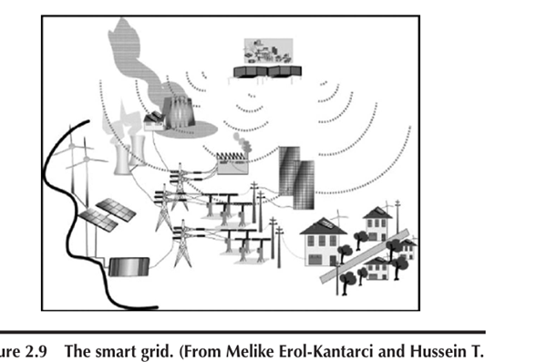
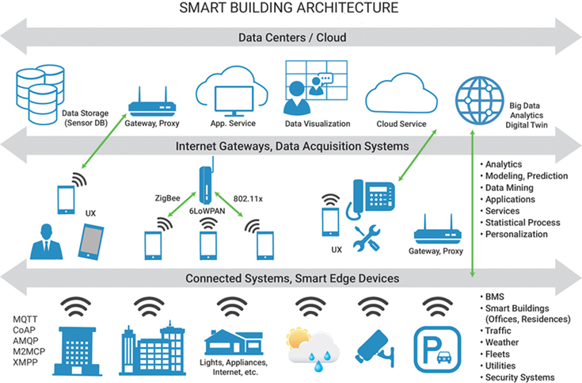
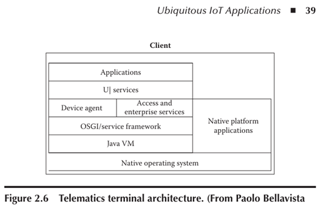
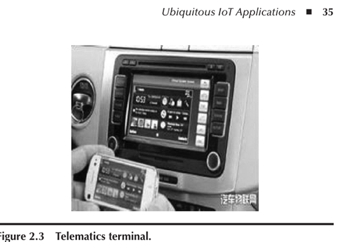
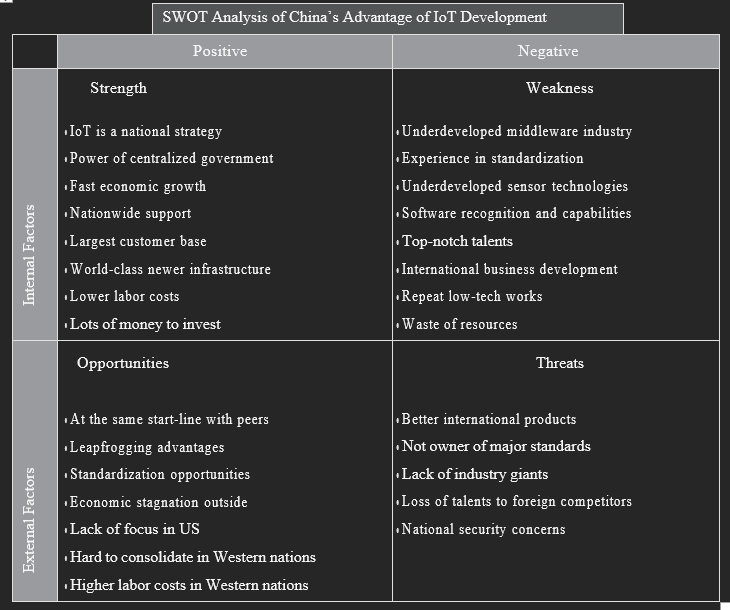

# Smart Grid and Electric Vehicles

### Smart Grid

The smart grid uses advanced communication and information technologies to manage energy efficiently. It monitors electricity usage and generation in real-time, allowing for quick adjustments to supply and demand. Technologies like IoT sensors and smart meters enable this by providing constant data feedback.

- **Enhanced Reliability**: Quickly responds to faults and outages, reducing downtime through automatic fixes.
- **Improved Efficiency**: Manages energy use in real-time, optimizing consumption and reducing waste.
- **Integration of Renewable Energy**: Easily incorporates solar and wind power, promoting sustainable energy practices.
- **Data-driven Decision Making**: Provides detailed insights into usage patterns and system health, aiding proactive maintenance.

### Electric Vehicles (EVs)

EVs play a dual role within the smart grid ecosystem, acting as both consumers of electricity and potential suppliers:

- Generally, EVs can charge themselves by consuming stored energy from the grid. They can also provide energy to the grid by injecting it back into the grid during periods of high demand or when renewable energy generation is low. This process is known as Vehicle-to-Grid (V2G) technology.

- **Role in Smart Grid Integration**: Through Vehicle-to-Grid (V2G) technology, EVs can inject stored electricity back into the grid during periods of high demand or when renewable energy generation is low. This capability enhances grid stability and reliability by balancing fluctuations in supply and demand.
  
- **V2G Concept**: Different types of EVs contribute differently to grid support. For instance, plug-in hybrids and battery electric vehicles (BEVs) can discharge stored energy to meet peak demands, while solar-powered EVs harness sunlight to charge their batteries, offering a direct renewable energy contribution.
  
- **Infrastructure and Standards**: Standardization of communication protocols and charging interfaces is crucial for seamless integration of EVs into the grid. Smart meters and advanced metering infrastructure (AMI) enable utilities to monitor EV charging patterns, manage grid load, and optimize energy distribution efficiently.

# Smart Building Management System

A Smart Building Management System (BMS) is a sophisticated platform that integrates and optimizes various aspects of building operations to enhance efficiency, energy management, and overall functionality.

  

### Components and Functionalities of a Smart BMS:

1. **Integrated Systems Control**:
   - **Building Automation System (BAS)**: Controls HVAC systems to maintain comfortable indoor environments efficiently.
   - **Security and Alert Systems**: Monitors and manages security cameras, access controls, and fire alarms for enhanced safety.
   - **Energy Management**: Tracks and optimizes energy usage, integrates renewable energy sources, and manages lighting systems.
   - **Closed-Circuit TV (CCTV)**: Provides real-time surveillance and recording to ensure security.
   - **Access Control**: Manages entry points to regulate building access for authorized personnel.
   - **Power and Lighting**: Controls lighting levels and optimizes power consumption throughout the building.
   - **Elevator Management**: Monitors and schedules elevator operations to improve efficiency and user convenience.
   - **Broadcasting and Background Music**: Manages audio systems for announcements and entertainment.
   - **Parking System**: Monitors and optimizes parking spaces for efficient usage.
   - **Network and Cable TV**: Manages IT infrastructure and cable TV services within the building.
   - **Property Management System (PMS)**: Integrates tenant management and maintenance scheduling.
   - **Office Automation**: Automates routine office tasks and integrates with other building systems such as HVAC, lighting, and security.

2. **Technological Integration**:
   - **IoT (Internet of Things)**: Utilizes IoT devices for real-time data collection and remote monitoring of building systems.
   - **Wireless Mesh Networks**: Provides flexible and robust connectivity across the building.
   - **Open Standards and Protocols**: Ensures interoperability using standards like ZigBee, EnOcean, and middleware platforms like Java servers.
   - **Data Analytics**: Applies analytics to interpret data for informed decision-making, enhancing operational efficiency and energy savings.

3. **Benefits of a Smart BMS**:
   - **Energy Efficiency**: Optimizes energy consumption through intelligent management of HVAC, lighting, and other systems.
   - **Cost Savings**: Reduces operational expenses by minimizing energy waste and improving maintenance efficiency.
   - **Enhanced Security**: Integrates robust security systems to safeguard occupants and assets.
   - **Improved Comfort**: Maintains consistent and comfortable indoor conditions for occupants.
   - **Remote Monitoring and Management**: Enables facility managers to oversee and control building systems remotely, improving responsiveness and operational efficiency.

# Telematics and Intelligent Transportation Systems

Telematics and Intelligent Transport Systems (ITS) are key domains within the realm of IoT (Internet of Things), focusing on enhancing transportation through advanced technology integration. Here's an explanation of each:

### Telematics:

Telematics is the technology of sending, receiving and storing information via telecommunications devices in conjunction with effecting control on remote objects especially for application in vehicles and with control of vehicles on the move.

Telematics involves the integration of telecommunications and informatics to transmit, receive, and store information related to remote objects, primarily applied in vehicles. Here are key aspects:

- **Definition**: Telematics is about sending, receiving, and storing vehicle-related data using technologies like GPS and mobile communication.
- **Applications**:
  - **Fleet Management**: Tracks and manages vehicle fleets for efficiency and maintenance. (fleets means vehicles that operate in a group, like a bus fleet or a delivery truck fleet)
  - **Insurance Telematics**: Adjusts insurance premiums based on driving behavior and mileage.
  - **Vehicle Diagnostics**: Monitors vehicle health in real-time for timely maintenance.
  - **Navigation Systems**: Provides drivers with real-time directions and traffic updates.
- **Technology**: Uses sensors, GPS, onboard computers, and mobile networks to create connected vehicle systems for safety and efficiency.

### Intelligent Transport Systems (ITS):

ITS refers to the application of information and communication technologies (ICT) in transport infrastructure and vehicles to improve overall transportation efficiency, safety, and sustainability.

> _Don't ever ask me why I've put this picture here._

- **Scope**:
  - **Traffic Management**: Uses real-time data to manage traffic flow and reduce congestion.
  - **V2I and V2V Communications**: **Vehicle-to-Infrastructure (V2I)** and **Vehicle-to-Vehicle (V2V)** enables vehicles to communicate with infrastructure and each other for safer driving.
  - **Advanced Driver Assistance Systems (ADAS)**: Assists drivers with navigation and collision avoidance.
  - **Public Transport Management**: Improves operations and reliability of buses, trains, etc.
- **Benefits**:
  - **Safety**: Enhances road safety through warnings and collision avoidance systems.
  - **Efficiency**: Optimizes travel times by managing traffic flow.
  - **Sustainability**: Reduces environmental impact through better traffic management and fuel efficiency.
- **Integration with IoT**: Leverages IoT to gather and process data from vehicles and infrastructure in real-time, improving decision-making for transport systems.

# SWOT Analysis on IoT

> It's absurd to expect a SWOT analysis on IoT based solely on notes about SWOT on China's advantages in IoT. It narrows our understanding. So If you want actual SWOT Analysis of Iot, expand the follwoing section, or you can continue to read the rest of the dumb notes.

SWOT Analysis on IoT

### SWOT Analysis on IoT

| **Strengths**                                         | **Weaknesses**                                       |
|--------------------------------------------------------|------------------------------------------------------|
| Connectivity and Integration                           | Security Concerns                                    |
| Data Collection and Analytics                          | Interoperability Challenges                          |
| Automation and Efficiency                              | Complexity of Implementation                         |
| Scalability                                           | Reliability and Maintenance                          |
| Improved Decision Making                               | Privacy Issues                                       |

| **Opportunities**                                      | **Threats**                                           |
|--------------------------------------------------------|-------------------------------------------------------|
| Market Growth                                          | Cybersecurity Risks                                   |
| Edge Computing                                         | Regulatory Challenges                                 |
| AI and Machine Learning Integration                    | Data Overload                                         |
| Smart Home and Consumer IoT                            | High Initial Costs                                    |
| Environmental Monitoring                               | Lack of Standards                                     |

    

