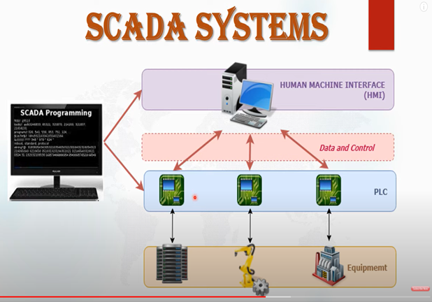
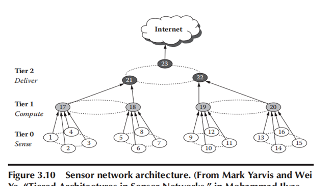
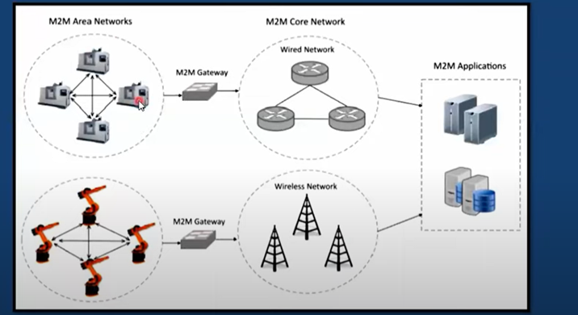
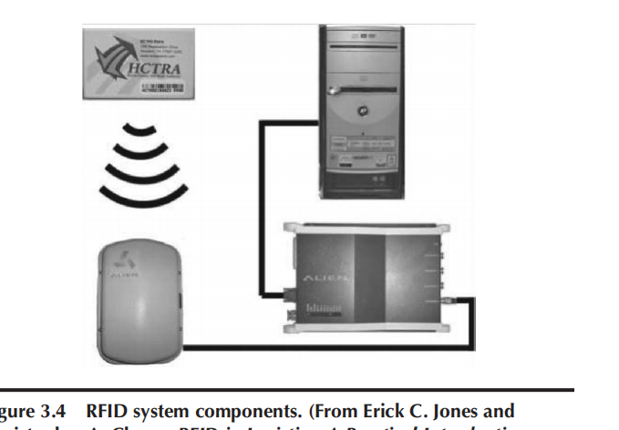

# 4 Pillars of IoT

1. **M2M (Machine-to-Machine)**: Uses devices like in-vehicle gadgets to capture events, such as engine issues, and sends this data over cellular or other networks to a central server. The server interprets these events to provide actionable alerts for maintenance.

2. **RFID (Radio Frequency Identification)**: Uses radio waves to transfer data from electronic tags on objects to a central system via a reader. This technology identifies and tracks objects efficiently.

3. **WSN (Wireless Sensor Network)**: Consists of autonomous sensors spread out to monitor physical or environmental conditions like temperature or motion. These sensors communicate data through short-range wireless mesh networks (and sometimes wired or hybrid networks) to a central location.

4. **SCADA (Supervisory Control and Data Acquisition)**: A system that connects, monitors, and controls equipment in facilities such as plants or buildings. It uses wired networks (often short-range field buses) or sometimes wireless or hybrid networks, applying closed-loop control or smart system principles.

[Refer here](./4pillars.pdf)

# SCADA (Supervisory Control and Data Acquisition) System

SCADA systems are integral to modern industrial operations, providing real-time data gathering, monitoring, and control capabilities across various sectors. They serve as sophisticated software applications designed to enhance operational efficiency and safety within manufacturing units and large-scale plants.

**Key Features and Applications:**

- **Real-Time Data Gathering and Display:** SCADA systems excel in gathering and displaying real-time data from industrial processes, allowing operators to monitor operations continuously.

- **Enhanced Plant Lifetime:** By facilitating proactive monitoring and control, SCADA systems contribute to extending the lifespan of industrial equipment and systems.

- **Integration with PLCs (Programmable Logic Controllers):** SCADA systems interface seamlessly with PLCs and other hardware devices to collect data and control industrial processes effectively.

- **Remote Monitoring and Control:** They enable remote monitoring and control of plant operations, offering flexibility and accessibility to operators.

**Industries and Applications:**

- **Manufacturing:** SCADA systems are widely used in manufacturing industries to monitor production processes and optimize efficiency.

- **Automation:** They are essential in automation industries, working alongside PLCs to manage and regulate complex systems.

- **Energy Sector:** Applications include electrical power generation, transmission, and distribution, where SCADA systems ensure reliable and efficient energy management.

- **Oil and Gas:** SCADA systems play a critical role in the oil and gas industry by monitoring pipelines, refineries, and distribution networks.

- **Transportation:** They contribute to managing traffic signals and transportation networks, enhancing safety and efficiency on roads.

# Wireless Sensor Networks (WSN)

Wireless Sensor Networks (WSNs) are decentralized networks of spatially distributed autonomous devices, equipped with sensors to monitor physical or environmental conditions and communicate wirelessly. They are designed to gather data from their surroundings and transmit it to a central location for analysis and decision-making.

**Components of WSN:**

- **End Nodes:** These are devices equipped with sensors that collect data and can also act as routers to relay data within the network.

- **Routers:** Responsible for forwarding data packets from end nodes to the central coordinator or gateway.

- **Coordinator/Gateway:** Central node that collects data from all nodes, aggregates it, and sends it to the server or control center.

**Characteristics of WSN:**

- **Wireless Protocols:** Utilizes various wireless protocols such as Zigbee, Bluetooth, and WiFi for communication.

- **Range:** Typically operates within a range of 10 to 100 meters, depending on the environment and protocol used.

- **Operating Frequency:** Depends on the specific application and protocol, ranging from low to high frequencies.

- **Low Power Operation:** Nodes are designed to operate on low power to prolong battery life, crucial for remote and unattended deployments.

- **Self-Organizing:** WSNs are capable of self-organizing and self-configuring, adapting to changes in the network and environment autonomously.

- **Robust Structure:** Designed to be robust against node failures and environmental challenges, ensuring reliable operation.

**Examples of WSN Applications:**

- **Weather Monitoring Systems:** Nodes collect data such as temperature, humidity, and atmospheric pressure for weather forecasting and analysis.

- **Indoor Air Quality Monitoring:** Monitors air quality parameters like CO2 levels, particulate matter, and VOCs to ensure healthy indoor environments.

- **Surveillance Systems:** Used for monitoring and surveillance in various environments, providing real-time data on movement and environmental conditions.

- **Smart Grids:** Utilized to monitor and control the electrical grid, ensuring efficient energy distribution and management across different points.

# Machine-to-Machine (M2M) 

Machine-to-Machine (M2M) communication refers to direct communication between devices using any communication channel, including wired and wireless. It is a foundational concept within the Internet of Things (IoT), focusing on device connectivity and data exchange.

**Six Pillars of M2M:**

1. **Remote Monitoring:** Involves supervisory control, data acquisition, and automation of industrial assets, enabling real-time monitoring and management.

2. **RFID:** Uses electronic tags to store and remotely retrieve data, crucial for tracking and managing inventory and assets.

3. **Sensor Networks:** Monitor physical or environmental conditions using cooperative sensor nodes, forming a network for data collection and analysis.

4. **Smart Service:** Networking equipment for effective monitoring and maintenance at customer sites, enhancing service delivery and efficiency.

5. **Telematics:** Integrates telecommunications and informatics, primarily used in vehicle tracking, navigation, and entertainment applications.

6. **Telemetry:** Transmits small amounts of wireless data, commonly used in industrial, medical, and wildlife tracking applications.

**Application Areas for Cellular M2M:**

| Industry         | Example Application          | Benefits                               |
|------------------|-----------------------------|----------------------------------------|
| Medical          | Wireless medical devices     | Remote patient monitoring              |
| Security         | Home alarm and surveillance | Real-time security and surveillance    |
| Utility          | Smart metering              | Energy, water, and gas conservation    |
| Manufacturing    | Industrial automation       | Productivity and cost savings          |
| Automotive       | Vehicle tracking            | Security against theft                 |

**M2M Architecture:**

- **Middleware Integration:** The server-side middleware acts as the central hub, managing data flow, application enablement, and service creation in the M2M system.

- **Cellular Networks:** Originally designed for voice, cellular networks now support data transmission, enabling M2M applications through packet-switched data.

- **Service Enablement:** Middleware layer facilitating application creation and delivery, enhancing the functionality and value of M2M solutions.

**Value Chain of M2M Business:**    

- Divided into two parts:
  1. **Device Management:** Involves the production and deployment of devices connected via M2M technologies.
  2. **Application Development and Service Delivery:** Focuses on creating applications and services that leverage M2M connectivity for specific industry needs.

**RFID: The Internet of Objects**

RFID (Radio Frequency Identification) technology enables the identification and tracking of objects using radio waves. Initially conceptualized within the Auto-ID Center, RFID has evolved into a fundamental component of the Internet of Things (IoT).

**Key Concepts:**

- **RFID Tags:** Simplified, low-cost, contactless smartcards containing a chip storing an ID number and attributes of the tagged object, along with an antenna for transmitting data to an RFID reader.

- **RFID System Components:**
  - **Readers:** Hardware devices that interact with RFID tags to read and write data.
  - **Tags:** Devices attached to objects, categorized as active (with a battery), passive (powered by reader's signal), or semi-passive (activated by reader).

- **Auto-ID Center:** A research federation pioneering networked RFID and sensing technologies, credited with coining the term "Internet of Things."

- **EPC (Electronic Product Code):** Stored on RFID tags, used as an index to locate associated data stored in databases or on the EPCglobal network.

- **Software and Middleware:** Facilitates communication between RFID hardware and enterprise systems, enhancing data management and integration capabilities.

**Additional Concepts:**

- **UPC and EAN:** Standards for identifying products in retail, with UPC prevalent in the US and EAN in Europe.

- **Object Naming Service (ONS):** Similar to DNS for the Internet, it routes requests for information about EPCs between users and manufacturers.

- **Java:** The programming language used for developing software specifications within the Auto-ID Center.

- **Contactless Smart Cards and NFC:** Utilizes induction technology similar to RFID, enabling secure data transfer between chips and readers, popular in mobile payments (e.g., NFC-enabled mobile wallets).

**Applications of RFID:**

- **Agriculture:** Tracking livestock and monitoring crop conditions.
- **Library Systems:** Managing and tracking books and other resources.
- **Retail Sector:** Inventory management, anti-theft systems, and supply chain optimization.
