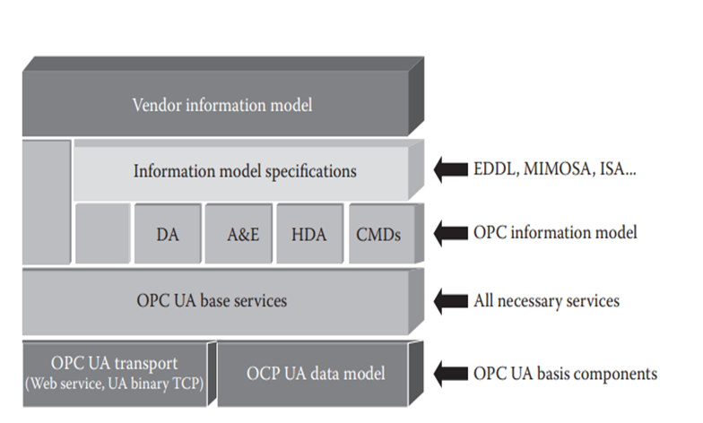

# Issues with IoT Standardization

IoT standardization faces significant challenges despite efforts from various organizations and vertical applications like smart grids and telematics. Here are two critical issues:

1. **Decentralization of ICT Standardization:**
   - ICT (Information and Communication Technology) standardization is decentralized, resulting in a network of diverse and sometimes conflicting standards.
   - Heterogeneous standards across different domains make interoperability and integration complex and challenging.
   - Harmonizing these standards becomes crucial to ensure seamless communication and compatibility within IoT ecosystems.

2. **Inclusivity in Standardization Process:**
   - Effective IoT standardization requires broad participation from all stakeholders involved in IoT technologies and applications.
   - It is essential to involve industry experts, academia, government bodies, and end-users to gather diverse perspectives and ensure comprehensive standardization.
   - Lack of inclusivity can lead to standards that do not fully address the needs and requirements of all stakeholders, hindering adoption and interoperability.

**Web-Oriented Standard Organizations:**
- **OASIS (Organization for the Advancement of Structured Information Standards):**
  - Specializes in standards for web services, cloud computing, and electronic business.
  - Its expertise extends to high-level, segment-independent standardization relevant to IoT (e.g., Web of Things).

- **W3C (World Wide Web Consortium):**
  - Develops standards for the web to ensure its interoperability and long-term growth.
  - Plays a crucial role in shaping IoT standards related to web technologies and interfaces.

# Framework of Wireless Sensor Networks (WSN)

Wireless Sensor Networks (WSN) are a key component of the Internet of Things (IoT) ecosystem, enabling the collection and transmission of data from distributed sensors to a central location. The framework of WSN involves various layers and components that work together to ensure efficient data communication and processing. Here's an overview of the key elements of the WSN framework:

### 1. OGC Sensor Web Enablement (SWE)

**What is it?**
OGC SWE(Open Geospatial Consortium, Sensor Web Enablement) is a set of standards that make it easier to use sensors over the internet. It aims to connect various sensors (like weather monitors or pollution detectors) and their data so that they can be easily found, accessed, and controlled online.

**Key Features:**
- **Discovery:** Helps find sensors, processes, and their data.
- **Tasking:** Allows controlling sensors and requesting specific data.
- **Access:** Provides ways to get sensor readings and streams of data.
- **Alerts:** Supports sending alerts when certain conditions are met.
  
**Standards Provided:**
- **Sensor Observation Service (SOS):** Access sensor data over the web.
- **Sensor Planning Service (SPS):** Control sensors and request data.
- **Sensor Alert Service (SAS):** Get alerts from sensors.
- **Web Notification Service:** Sends notifications about sensor data changes.

### 2. Ubiquitous Sensor Networks (USN)

**What is it?**
USN is a framework that uses existing networks to gather data from sensors and provide useful services based on that data. It's like a network that connects and manages sensors to give us information we need.

**Components:**
- **USN Applications Platform:** Framework to use USN in different applications.
- **USN Middleware:** Software that manages sensor networks, processes data, and connects everything.
- **Network Infrastructure:** Uses existing networks (like internet or mobile networks) to transmit sensor data.
- **USN Gateway:** Connects sensor networks with other types of networks.
- **Sensor Network:** Network of connected sensors, which can be directly connected or through gateways.

**Purpose:**
USN helps make sense of data collected by sensors in real-world environments, enabling applications like environmental monitoring, smart cities, and more efficient industrial processes.

# M2M Standards

The standards and architecture frameworks for Machine-to-Machine (M2M) communications, as outlined by various organizations and initiatives such as ETSI(European Telecommunications Standards Institute) and OMA(Open Mobile Alliance), focus on ensuring interoperability and enabling seamless automated data exchange between machines. Here's a structured format summarizing the key elements and standards in M2M:

### Key Elements of M2M Architecture:

_The examples also imply the standards/protocols they need to follow_

1. **M2M Device**:
   - Definition: Autonomous devices capable of responding to requests or transmitting data without human intervention.
   - Examples: Sensors, actuators, smart meters.

2. **M2M Area Network (MAN)**:
   - Definition: Provides connectivity between M2M devices and gateways.
   - Examples: IEEE 802.15 (wireless), CanBus, Modbus (wired), ZigBee, Bluetooth.

3. **M2M Gateway**:
   - Definition: Facilitates interworking and connectivity of M2M devices to communications networks.
   - Purpose: Ensures seamless data flow between devices and broader networks.

4. **M2M Communications Networks**:
   - Definition: Networks connecting M2M gateways to M2M application servers.
   - Components: Access networks (xDSL, PLC), transport networks (LTE, WiMAX), core networks (eUTRAN, GERAN).

5. **M2M Application Server**:
   - Definition: Middleware layer where data is processed and utilized by business applications.
   - Role: Hosts application services, integrates with M2M devices and gateways.

### Standards and Initiatives:

- **ETSI (European Telecommunications Standards Institute)**:
  - Defines M2M architecture elements and interfaces.
  - Standards cover network protocols, device management, gateway functionalities, and application server interactions.

- **OMA (Open Mobile Alliance)**:
  - Task Force focuses on M2M standards development.
  - Provides frameworks for device management, firmware updates, software provisioning, and diagnostics.
  - Addresses interoperability and service management across M2M networks.

- **Car-to-Car Communication Consortium**:
  - Focuses on vehicle-to-vehicle (V2V) and vehicle-to-infrastructure (V2I) communications.
  - Uses IPv6 for vehicle identifiers and geographical routing for efficient message delivery.
  - Aims to enhance road safety and traffic efficiency through standardized communication protocols.

### Industry Applications and Use Cases:

- **Smart Grid Applications**:
  - Actility provides infrastructure for IoT applications in smart grids.
  - Focuses on scalability and reliability for mission-critical applications.

- **Roadside Units (RSUs)**:
  - Deployed along roadsides to act as gateways for vehicular on-board units.
  - Support vehicle-to-roadside (V2R) communications for traffic management and safety applications.

# Standards of SCADA

Standards are essential in the realm of SCADA (Supervisory Control and Data Acquisition) systems to ensure they operate efficiently, securely, and reliably across diverse industrial applications. Here's an overview focusing on key standards:

### 1. ISO 16100-1:2009
- **Purpose**: Establishes a framework for the interoperability of software products within the manufacturing domain.
- **Components Addressed**:
  - Information exchange models
  - Software object models
  - Interfaces, services, and protocols
  - Capability profiles
  - Conformance test methods

ISO 16100-1 gives rules to make different software in factories work well together by improving their compatibility and interoperability.

### 2. ANSI/ISA-95
- **Purpose**: Standardizes the integration between enterprise and control systems to streamline operations and reduce costs and risks.
- **Parts**:
  - **ANSI/ISA-95.00.01-2000**: Defines models and terminology.
  - **ANSI/ISA-95.00.02-2001**: Specifies object model attributes.
  - **ANSI/ISA-95.00.03-2005**: Details models for manufacturing operations management.
  - **ISA-95.04 and ISA-95.05**: Further refine object models and describe business to manufacturing transactions.

ISA-95 helps connect business and manufacturing systems smoothly, making operations more efficient and integration easier.

### 3. OPC Unified Architecture (UA)
   
- **Purpose**: Modernizes communication protocols within SCADA systems, replacing DCOM with platform-independent protocols.
- **Features**:
  - Platform independence (support for JavaEE, .NET, and C)
  - Enhanced security mechanisms
  - Object-oriented model encompassing data access, alarms/events, historical data, methods, and type systems.

OPC UA improves how different systems work together securely, adding more features than typical SCADA systems.

# Extensions of RFID Standards

### CASAGRAS and CASAGRAS2 Projects
CASAGRAS and CASAGRAS2 were projects aimed at advancing RFID technology within the framework of the Internet of Things (IoT). CASAGRAS started in 2009 and CASAGRAS2 continued from 2010 to 2012. They brought together international partners to address global RFID issues and support standards development for IoT applications.

- **Improvements:**
  - **Standardization:** Facilitated global collaboration on RFID standards, crucial for interoperability.
  - **Research Basis:** Provided foundational studies aiding the development of RFID technologies within the IoT context.
  - **International Coordination:** Fostered partnerships across Europe, the US, China, Japan, Brazil, and Korea to address global RFID challenges.

### BRIDGE Project
The BRIDGE project, funded by the EU, focused on overcoming barriers to RFID adoption in Europe. It extended EPCglobal standards, enhancing the infrastructure for RFID systems. A key aspect was its contribution to IoT-A, specifically through the Discovery Service, which enabled efficient data exchange among RFID nodes.

- **Improvements:**
  - **Extended Standards:** Enhanced EPCglobal standards to overcome barriers to RFID adoption in Europe.
  - **IoT Integration:** Contributed to IoT-A by developing the Discovery Service, optimizing RFID data exchange among nodes.
  - **EU Support:** Supported by EU funding, ensuring broad implementation and support within European regions.

### Cross UBiQuitous Platform (CUBIQ) Project
CUBIQ aimed to create a unified platform for context-aware applications using RFID technology. It involved nine organizations in Japan and emphasized seamless integration of data and services across diverse IoT architectures. Key components included mobile terminals equipped with RFID readers, a core infrastructure for data sharing, and systems for locating individuals or objects based on RFID tags.

- **Improvements:**
  - **Unified Platform:** Developed a cohesive platform for context-aware applications using RFID technology.
  - **Data Integration:** Unified data access and processing across diverse IoT architectures, enhancing efficiency.
  - **Location Services:** Enabled precise location estimation of individuals or objects through RFID tag information.
  - **Standardization with USDL:** Utilized USDL for defining universal service models, promoting interoperability.

