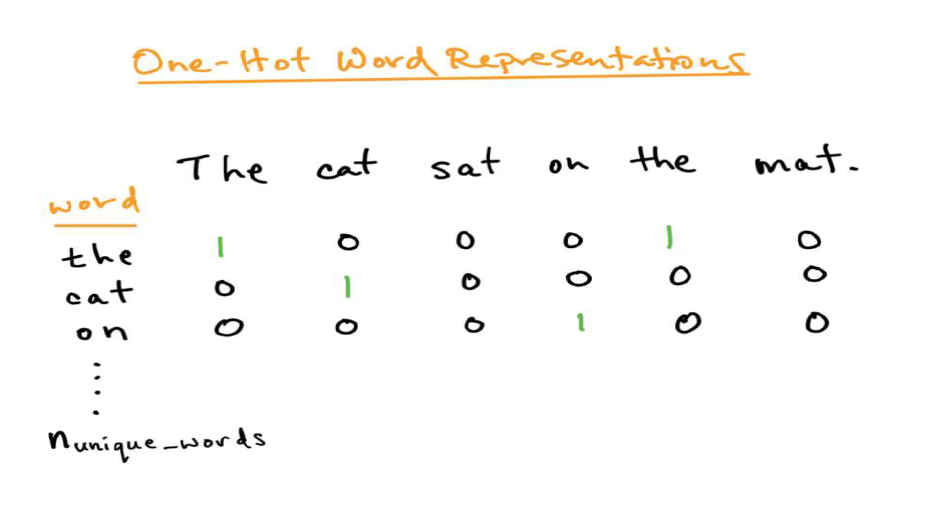
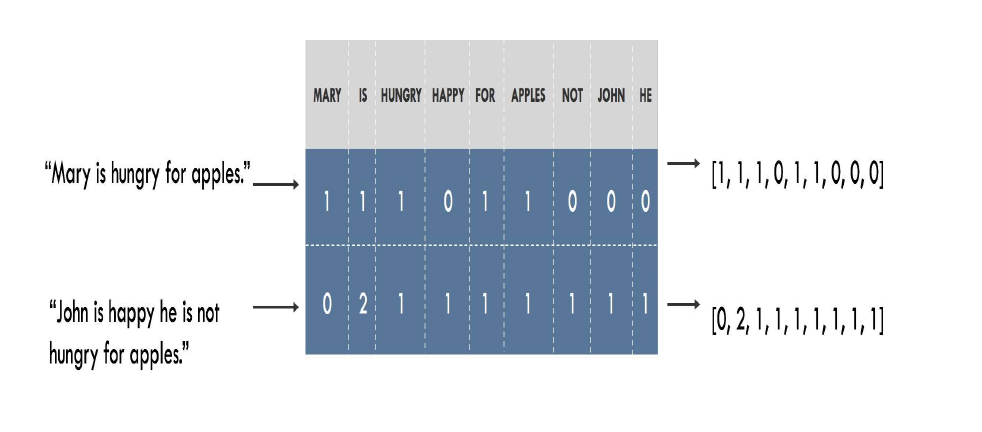
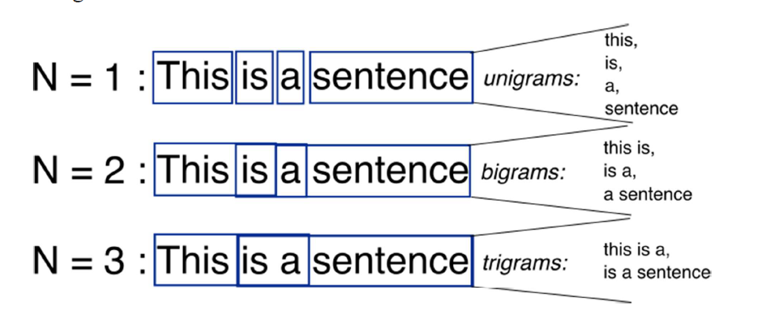

# Recommender Systems

Recommender systems are powerful tools used in e-commerce and other domains to predict users' interests and suggest products or content they are likely to find appealing. Here, we will elaborate on two types of recommender systems: **Content-Based Recommender Systems** and **Collaborative Filtering Systems**.

### Content-Based Recommender Systems

Content-based recommender systems make recommendations by analyzing the attributes of items and the preferences of users. They hypothesize that if a user liked an item in the past, they will likely enjoy similar items in the future. These systems utilize keywords, categories, or other descriptive information about items to make recommendations.

#### Key Features:
- **User Profiles**: These are created using historical data of users' interactions or by explicitly asking users about their preferences.
- **Item Features**: Items are categorized based on their features. For example, movies can be categorized by genre, director, cast, etc.
- **Recommendation Process**: The system matches user profiles with item features to find the best matches. For example, if a user frequently watches action movies, the system will recommend other action movies.

#### Example:
Consider a movie recommendation system. If a user has watched and liked several sci-fi movies, the system will recommend other sci-fi movies based on features such as genre, director, and cast.

#### Issues:
- **Over-specialization**: The system may recommend items too similar to what the user has already consumed, missing out on potentially interesting items outside the known preferences.
- **New User Problem**: For new users with no prior interactions, the system has limited data to generate recommendations.

### Collaborative Filtering Systems

Collaborative filtering is one of the most popular and effective approaches to recommender systems. This technique relies on past user interactions to generate recommendations. Collaborative filtering can be divided into two main types: **User-Based Collaborative Filtering** and **Item-Based Collaborative Filtering**.

#### Key Features:
- **User-Item Interactions**: The system uses data such as ratings, clicks, and purchase history to identify patterns in user behavior.
- **Matrix Representation**: Interactions are often represented in a matrix form, where rows represent users and columns represent items. Each entry in the matrix indicates the interaction (e.g., rating) between a user and an item.

#### Methods:
- **User-Based Collaborative Filtering**: This method finds users who have similar preferences and recommends items that these similar users have liked. For example, if users A and B have similar tastes, items liked by B will be recommended to A.
- **Item-Based Collaborative Filtering**: This method finds items that are similar to what a user has liked in the past and recommends these similar items. For example, if a user likes item X, and item Y is similar to X, item Y will be recommended.

#### Example:
Consider a music streaming service like Spotify. If user A and user B have a high overlap in their music preferences, and user B listens to a new song, this song will be recommended to user A based on the assumption that A might also like it.

#### Issues:
- **Cold Start Problem**: This occurs when there is insufficient data about new users or new items. The system struggles to make accurate recommendations without a history of interactions.
- **Scalability**: As the number of users and items grows, the computational complexity of generating recommendations increases.

#### Advantages:
- **Personalization**: Collaborative filtering provides highly personalized recommendations by leveraging the preferences of similar users.
- **Adaptability**: The system can adapt to changes in user preferences over time as more interaction data becomes available.

### Conclusion

Recommender systems are essential for enhancing user experience and driving engagement on platforms by providing personalized suggestions. Content-based systems focus on the attributes of items and user profiles, while collaborative filtering systems leverage the interactions between users and items. Both methods have their strengths and challenges, and often a hybrid approach combining both techniques is employed to achieve better performance and address the limitations of each method.

# Sentiment Analysis

**Sentiment Analysis**, also known as opinion mining, is a natural language processing (NLP) technique used to determine the sentiment expressed in a piece of text. The sentiment can be categorized as positive, negative, or neutral, and can further be classified into more nuanced emotions such as happiness, anger, sadness, etc. This process helps businesses monitor brand and product sentiment in customer feedback and understand customer needs.

## Types of Sentiment Analysis

1. **Fine-grained Sentiment Analysis**
   Fine-grained sentiment analysis involves more detailed categories of sentiment, typically ranging from very positive to very negative. This is useful for interpreting 5-star ratings, for example:
   - Very Positive = 5 stars
   - Positive
   - Neutral
   - Negative
   - Very Negative = 1 star

   **Example**: Analyzing customer reviews where ratings are converted into sentiment categories, such as a 5-star rating being classified as very positive.

2. **Emotion Detection**
   Emotion detection focuses on identifying specific emotions such as happiness, frustration, anger, and sadness. This type often uses lexicons (lists of words associated with specific emotions) or machine learning algorithms.

   **Example**: Detecting customer emotions from feedback to understand whether customers are frustrated with a service or happy with a product. For instance, the word "frustrated" might directly indicate a negative emotion related to a service experience.

3. **Aspect-based Sentiment Analysis**
   Aspect-based sentiment analysis identifies the sentiment about specific aspects or features of a product or service. It helps in pinpointing which features are praised or criticized.

   **Example**: In a review stating, "The battery life of this camera is too short," an aspect-based analysis would identify "battery life" as the feature and "too short" as the negative sentiment associated with it.

4. **Multilingual Sentiment Analysis**
   This involves analyzing sentiments across texts written in different languages. It requires extensive preprocessing and resources such as sentiment lexicons and translated corpora.

   **Example**: Analyzing social media posts in various languages to understand global sentiment about a brand. Preprocessing steps might include translating text to a common language or using language-specific sentiment analysis tools.

### Applications of Sentiment Analysis

Sentiment analysis has wide-ranging applications across various industries:

- **Social Media Monitoring**: Understanding public sentiment about a brand or product in real-time.
- **Brand Monitoring**: Tracking sentiment over time to gauge brand reputation.
- **Voice of Customer (VoC)**: Analyzing customer feedback from surveys and support interactions to improve services.
- **Customer Service**: Automatically categorizing and routing support tickets based on sentiment to prioritize urgent issues.
- **Market Research**: Assessing product reviews and social media discussions to understand market trends and customer preferences.

### Example of Sentiment Analysis in Practice

Consider a scenario where a company wants to analyze customer reviews to understand their opinions about different features of a new smartphone. They might use a combination of fine-grained and aspect-based sentiment analysis:

- **Fine-grained Analysis**: Categorize each review into very positive, positive, neutral, negative, or very negative based on overall sentiment.
- **Aspect-based Analysis**: Identify specific features such as battery life, camera quality, and screen size, and determine the sentiment associated with each feature.

By combining these approaches, the company can gain detailed insights into customer satisfaction and areas needing improvement.

# Collaborative Filtering Systems

Collaborative filtering is a popular technique used in recommendation systems to predict user preferences and suggest items based on user-item interactions. It leverages the collective behavior and preferences of multiple users to generate recommendations. Collaborative filtering can be broadly categorized into two main approaches: memory-based and model-based methods.

### Memory-Based Collaborative Filtering

Memory-based methods rely on the entire dataset of user-item interactions to make predictions. These methods can be further divided into user-based and item-based approaches.

1. **User-Based Collaborative Filtering**:
   - This method identifies users with similar tastes and preferences to the target user. Recommendations are made by finding items liked by similar users that the target user hasn't interacted with yet.
   - Example: If User A and User B have both liked items X and Y, and User B has also liked item Z, then item Z would be recommended to User A.

2. **Item-Based Collaborative Filtering**:
   - This method focuses on finding similarities between items based on user interactions. Recommendations are made by identifying items similar to those the target user has already liked.
   - Example: If User A liked item X, and items X and Y have been liked together by many users, then item Y would be recommended to User A.

Memory-based collaborative filtering can face challenges with large, sparse datasets because the number of user-item interactions can be too low to generate high-quality clusters.

### Model-Based Collaborative Filtering

Model-based methods use machine learning and data mining techniques to build predictive models from the user-item interaction data. These models are then used to predict user preferences.

1. **Matrix Factorization**:
   - A common technique where the user-item interaction matrix is decomposed into lower-dimensional matrices representing latent factors for users and items. The product of these matrices approximates the original interaction matrix.
   - Example: Singular Value Decomposition (SVD) is a widely used matrix factorization technique in collaborative filtering.

2. **Deep Learning Models**:
   - Neural networks and other deep learning architectures can be employed to model complex user-item interactions and capture latent factors. These models can handle non-linear relationships and large-scale data more effectively.
   - Example: Autoencoders can be used for collaborative filtering by encoding user preferences into a compressed latent space and decoding them to reconstruct and predict missing interactions.

### Example: Netflix Recommendation System

Netflix uses collaborative filtering to recommend movies and TV shows to its users. Here's how it works:

1. **Data Collection**:
   - Netflix collects data on user interactions, such as viewing history, ratings, and search queries.

2. **Model Training**:
   - Using matrix factorization, Netflix decomposes the user-item interaction matrix into latent factors. Each user and item is represented by a vector in the latent factor space.

3. **Making Recommendations**:
   - For a given user, Netflix computes the dot product between the user's latent factor vector and the item vectors. Items with the highest scores are recommended to the user.

4. **Cold Start Problem**:
   - To handle new users or items with no prior interactions, Netflix employs hybrid approaches combining collaborative filtering with content-based filtering, using metadata like genres, actors, and descriptions.

### Challenges in Collaborative Filtering

1. **Cold Start**:
   - Collaborative filtering requires sufficient user-item interaction data to make accurate recommendations. New users or items with no interaction history pose a challenge.
   - Solution: Hybrid approaches can be used, combining collaborative filtering with content-based methods to utilize additional metadata.

2. **Scalability**:
   - Large-scale datasets with millions of users and items can be computationally expensive to process using memory-based methods.
   - Solution: Model-based approaches, particularly those using matrix factorization and deep learning, can scale better to handle large datasets.

3. **Sparsity**:
   - User-item interaction matrices are often sparse, with many missing values due to users interacting with only a small fraction of available items.
   - Solution: Advanced matrix factorization techniques and deep learning models can effectively handle sparsity by capturing latent factors and patterns in the data.

# Text Representation Techniques

In sentiment analysis, the choice of text representation techniques plays a crucial role in how effectively the sentiment of a piece of text can be understood and classified. Let's discuss how each of the mentioned techniques—One Hot Encoding, Bag of Words (BOW), N-grams, and Word Embedding—can be applied and their implications in sentiment analysis:

1. **One Hot Encoding:**
   - **Concept:** One Hot Encoding represents each word in the vocabulary as a sparse binary vector where only one bit is hot (1), corresponding to the index of the word in the vocabulary.
   - **Application in Sentiment Analysis:** While straightforward, One Hot Encoding ignores semantic relationships between words and does not capture context or meaning. In sentiment analysis, this method can be limited because it doesn't differentiate between different words that might carry similar sentiment implications.

2. **Bag of Words (BOW):**
   - **Concept:** BOW represents a document as a multiset of its words, disregarding grammar and word order but retaining multiplicity.
   - **Application in Sentiment Analysis:** BOW is useful for sentiment analysis as it focuses on word occurrence frequencies. It treats each document as a collection of words and their counts, which can give a basic idea of the sentiment based on the presence and frequency of sentiment-laden words (e.g., 'happy', 'sad', 'good', 'bad').

3. **N-grams:**
   - **Concept:** N-grams are sequences of N contiguous words in a text. They capture local word dependencies and are more informative than individual words alone.
   - **Application in Sentiment Analysis:** N-grams can provide context-specific sentiment clues. For example, phrases like "not good" versus "very good" have opposite sentiments despite sharing the word "good". By including N-grams (bi-grams, tri-grams, etc.) in feature representation, sentiment analysis models can better grasp nuances in sentiment expression.

4. **Word Embedding (e.g., Word2Vec):**
   - **Concept:** Word Embeddings map words into dense vectors in a continuous vector space where semantically similar words have similar vector representations.
   - **Application in Sentiment Analysis:** Word Embeddings excel in capturing semantic relationships and context. Sentiment analysis benefits from embeddings as they encode not just the presence of words, but their meaning and contextual usage. Models trained with word embeddings can generalize better across different texts and capture sentiment nuances more effectively.

**Usage Scenarios:**
- **For Simple Models:** One Hot Encoding and BOW are simpler and more interpretable, suitable for basic sentiment analysis tasks where context and semantics are less critical.
  
- **For Nuanced Analysis:** N-grams and Word Embeddings are preferred for more sophisticated sentiment analysis tasks. N-grams help capture phrase-level sentiment clues, while Word Embeddings enhance the model's ability to understand context and word relationships.

**Choosing the Right Technique:**
- **Data and Task Complexity:** Choose simpler methods like BOW or One Hot Encoding for smaller datasets or when computational resources are limited.
  
- **Contextual Understanding:** Opt for N-grams or Word Embeddings when dealing with larger datasets or when nuanced sentiment analysis is required, such as understanding sentiment in reviews or social media posts.
